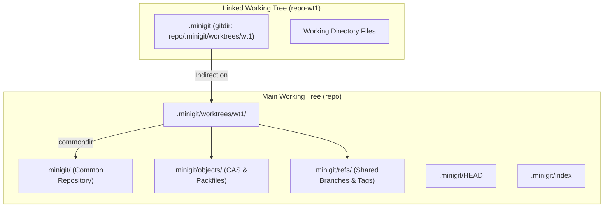
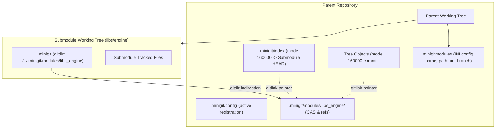
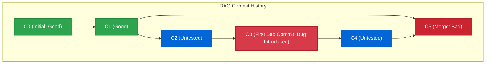
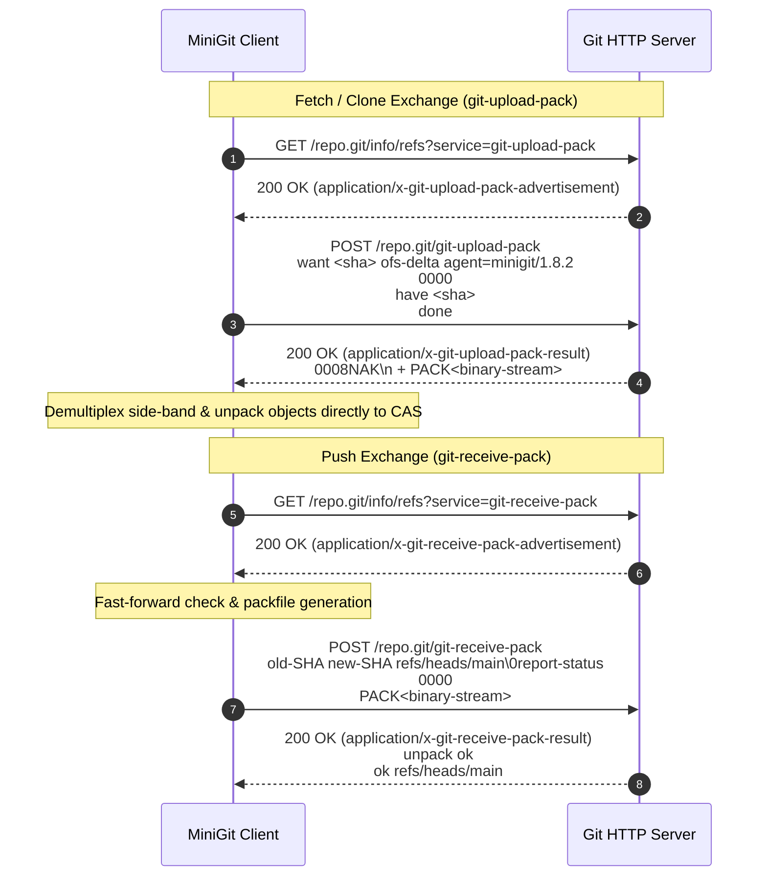

# MiniGit Features & Technical Specification

This document provides a comprehensive, production-grade technical specification of **MiniGit**, covering its command-line interface, underlying subsystems, algorithms, data structures, storage formats, and behavioral semantics.

> 📖 For practical CLI usage examples, daily workflows, and recipe guides, see [USAGE.md](USAGE.md). For installation instructions and pre-built binaries, see [README.md](README.md).

---

## Table of Contents

- [1. Architecture Overview](#1-architecture-overview)
  - [1.1 Porcelain vs. Plumbing Model](#11-porcelain-vs-plumbing-model)
  - [1.2 Content-Addressable Storage (CAS) Engine](#12-content-addressable-storage-cas-engine)
  - [1.3 The Three-Tree State Model](#13-the-three-tree-state-model)
- [2. Command Reference & Semantics](#2-command-reference--semantics)
  - [2.1 `minigit init`](#21-minigit-init)
  - [2.2 `minigit status`](#22-minigit-status)
  - [2.3 `minigit add`](#23-minigit-add)
  - [2.4 `minigit commit`](#24-minigit-commit)
  - [2.5 `minigit log`](#25-minigit-log)
  - [2.6 `minigit diff`](#26-minigit-diff)
  - [2.7 `minigit branch`](#27-minigit-branch)
  - [2.8 `minigit switch`](#28-minigit-switch)
  - [2.9 `minigit checkout`](#29-minigit-checkout)
  - [2.10 `minigit hash-object`](#210-minigit-hash-object)
  - [2.11 `minigit write-tree`](#211-minigit-write-tree)
  - [2.12 `minigit cat-file`](#212-minigit-cat-file)
  - [2.13 `minigit tag`](#213-minigit-tag)
  - [2.14 `.minigitignore`](#214-minigitignore)
  - [2.15 `minigit reset`](#215-minigit-reset)
  - [2.16 `minigit merge`](#216-minigit-merge)
  - [2.17 `minigit revert`](#217-minigit-revert)
  - [2.18 `minigit stash`](#218-minigit-stash)
  - [2.19 `minigit remote`](#219-minigit-remote)
  - [2.20 `minigit clone`](#220-minigit-clone)
  - [2.21 `minigit fetch`](#221-minigit-fetch)
  - [2.22 `minigit push`](#222-minigit-push)
  - [2.23 `minigit pull`](#223-minigit-pull)
  - [2.24 `minigit cherry-pick`](#224-minigit-cherry-pick)
  - [2.25 `minigit show`](#225-minigit-show)
  - [2.26 `minigit clean`](#226-minigit-clean)
  - [2.27 `minigit ls-files`](#227-minigit-ls-files)
  - [2.28 `minigit ls-tree`](#228-minigit-ls-tree)
  - [2.29 `minigit rebase`](#229-minigit-rebase)
  - [2.30 `minigit repack`](#230-minigit-repack)
  - [2.31 `minigit verify-pack`](#231-minigit-verify-pack)
  - [2.32 `minigit worktree`](#232-minigit-worktree)
  - [2.33 `minigit submodule`](#233-minigit-submodule)
  - [2.34 `minigit bisect`](#234-minigit-bisect)
  - [2.35 Smart HTTP Network Remotes](#235-smart-http-network-remotes)
  - [2.36 `minigit version`](#236-minigit-version)
  - [2.37 `minigit install` (Permission-Based Installation)](#237-minigit-install-permission-based-installation)
  - [2.38 `minigit update`](#238-minigit-update)
- [3. Storage & Object Internals](#3-storage--object-internals)
  - [3.1 Object Envelope Format](#31-object-envelope-format)
  - [3.2 Blob Objects](#32-blob-objects)
  - [3.3 Tree Objects](#33-tree-objects)
  - [3.4 Commit Objects](#34-commit-objects)
  - [3.5 Annotated Tag Objects](#35-annotated-tag-objects)
  - [3.6 Object Database Sharding](#36-object-database-sharding)
  - [3.7 Packfiles (`.pack`) and Index (`.idx`) Format with Delta Compression](#37-packfiles-pack-and-index-idx-format-with-delta-compression)
- [4. Staging Engine & Index Specification](#4-staging-engine--index-specification)
  - [4.1 On-Disk Index Format](#41-on-disk-index-format)
  - [4.2 In-Memory Representation](#42-in-memory-representation)
  - [4.3 Path Resolution & Normalization](#43-path-resolution--normalization)
  - [4.4 Recursive Directory & Tree Staging (`minigit add .`)](#44-recursive-directory--tree-staging-minigit-add-)
- [5. Diff Engine & LCS Algorithm](#5-diff-engine--lcs-algorithm)
  - [5.1 Longest Common Subsequence Formulation](#51-longest-common-subsequence-formulation)
  - [5.2 CRLF & End-of-Line Handling](#52-crlf--end-of-line-handling)
  - [5.3 Unified Diff Formatter](#53-unified-diff-formatter)
  - [5.4 Diff Operation Modes](#54-diff-operation-modes)
- [6. Reference & Branching Mechanics](#6-reference--branching-mechanics)
  - [6.1 Symbolic References](#61-symbolic-references)
  - [6.2 Detached HEAD Operation](#62-detached-head-operation)
  - [6.3 Branch Safety Constraints](#63-branch-safety-constraints)
- [7. Error Handling & Security](#7-error-handling--security)
- [8. Canonical Git Comparison Matrix](#8-canonical-git-comparison-matrix)
- [9. Future Feature Roadmap](#9-future-feature-roadmap)

---

## 1. Architecture Overview

MiniGit is architected around the core data structures and state transitions of Git. It operates entirely locally without external daemons, relying on filesystem operations and cryptographic hashing.

### 1.1 Porcelain vs. Plumbing Model

Borrowing from standard Git architecture, MiniGit separates commands into two conceptual tiers:

1. **Porcelain Commands:** High-level, user-facing commands designed for daily developer workflows:
   - `init`, `status`, `add`, `commit`, `log`, `diff`, `branch`, `switch`, `checkout`, `tag`, `reset`, `merge`, `revert`, `cherry-pick`, `rebase`, `stash`, `clean`, `show`, `worktree`, `submodule`, `bisect`, `remote`, `clone`, `fetch`, `push`, `pull`, `repack`, `version`.
2. **Plumbing Commands:** Low-level commands designed for scriptability, tooling, and granular manipulation of the object database and index:
   - `hash-object`, `write-tree`, `cat-file`, `ls-files`, `ls-tree`, `verify-pack`.

### 1.2 Content-Addressable Storage (CAS) Engine

Every unit of data in MiniGit (files, directory trees, commit records) is uniquely identified by its cryptographic SHA-256 hash. If two files in different folders or across different commits share the exact same content, MiniGit stores only a single physical object file, guaranteeing deduplication and immutability.

### 1.3 The Three-Tree State Model

MiniGit manages state across three distinct environments:

```text
┌───────────────────────────┐      ┌───────────────────────────┐      ┌───────────────────────────┐
│     WORKING DIRECTORY     │      │       INDEX (STAGING)     │      │        HEAD COMMIT        │
│                           │      │                           │      │                           │
│  Actual physical files    │ ---> │ Cached map of tracked     │ ---> │ Immutable tree snapshot   │
│  on the local filesystem  │ add  │ relative path to blob ID  │commit│ of repository state       │
└───────────────────────────┘      └───────────────────────────┘      └───────────────────────────┘
```

The system continuously tracks deltas between these three trees to report status, produce diffs, and perform safe checkout operations.

---

## 2. Command Reference & Semantics

### 2.1 `minigit init`

#### Synopsis
```bash
minigit init
```

#### Purpose
Initializes a new MiniGit repository in the current working directory or reinitializes an existing one.

#### Behavioral Details
1. Checks whether `.minigit` already exists in the current working directory.
2. Creates the required internal directory hierarchy:
   - `.minigit/objects/`
   - `.minigit/refs/heads/`
   - `.minigit/refs/tags/`
3. Initializes metadata files if not already present:
   - `.minigit/HEAD`: Populated with `ref: refs/heads/main\n`.
   - `.minigit/config`: Empty placeholder for local configuration.
   - `.minigit/index`: Empty staging area.
4. Outputs appropriate confirmation message depending on whether the repository was newly created or reinitialized.

#### Example
```bash
$ minigit init
Initialized empty mini_git repository in C:/dev/project/.minigit/
```

---

### 2.2 `minigit status`

#### Synopsis
```bash
minigit status
```

#### Purpose
Inspects and categorizes the differences between the Working Directory, the Staging Index, and the HEAD commit.

#### Behavioral Details
1. Discovers repository root by traversing upward from the current working directory (`Repository::discover`).
2. Determines the current branch by reading `.minigit/HEAD`:
   - If symbolic ref `ref: refs/heads/<branch>`, extracts `<branch>`.
   - If detached HEAD, reports `HEAD (detached)`.
3. Reads `.minigit/index` into memory.
4. Scans the working tree recursively, excluding `.minigit` and internal hidden directories.
5. Classifies files into 4 categories:
   - **Changes to be committed (Staged):** Files present in the index.
   - **Changes not staged for commit (Modified):** Files in the index whose working tree content produces a different SHA-256.
   - **Changes not staged for commit (Deleted):** Files in the index that no longer exist in the working tree.
   - **Untracked files:** Regular files in the working tree that do not appear in the index.
6. Displays the formatted summary in standard Git color-compatible sections.

#### Example
```bash
$ minigit status
On branch main

Changes to be committed:
	new file:   src/main.cpp
	new file:   README.md

Changes not staged for commit:
	modified:   CMakeLists.txt

Untracked files:
	notes.txt
```

---

### 2.3 `minigit add`

#### Synopsis
```bash
minigit add (<file> | <directory> | .) [<path>...]
```

#### Purpose
Stages changes by storing file content into the object database as blobs and recording relative paths and blob hashes into `.minigit/index`. Supports individual files, directory trees, and entire working tree staging (`minigit add .`), as well as staging file deletions.

#### Behavioral Details
1. For each specified path:
   - Resolves canonical absolute path and normalizes relative path within repository root.
   - Validates that the path is within the repository root (prevents path traversal out of the workspace).
   - **Path does not exist on disk:** If the path (or a directory containing tracked files) was deleted from the working tree, stages the removal from the index.
   - **Path is a directory (e.g. `.` or a subfolder):**
     - Recursively walks the directory, discovering all untracked and modified regular files.
     - Automatically skips `.minigit` and `.git` internals.
     - Respects `.minigitignore` ignore rules (skips ignored directories and files without error).
     - Persists new and modified files as blobs in `.minigit/objects/` and updates their index entries.
     - Detects and stages the removal of any tracked files within the directory that were deleted on disk.
   - **Path is a regular file:**
     - Checks `.minigitignore` (warns and skips if ignored and not already tracked).
     - Reads file in binary mode, generates SHA-256 blob object, stores in `.minigit/objects/`, and records in `.minigit/index`.
2. Persists the updated index atomically to disk (`.minigit/index`) if no fatal errors occurred.
3. Exits with status code 0 on success, or 1 if any invalid pathspec was specified.

#### Example
```bash
# Stage individual files
$ minigit add src/main.cpp include/header.h

# Stage entire repository / working tree from current location
$ minigit add .

# Stage an entire subdirectory
$ minigit add src/
```

---

### 2.4 `minigit commit`

#### Synopsis
```bash
minigit commit -m <message> [--author <author>]
```

#### Purpose
Captures the current state of the staging index as a persistent, immutable commit object and updates the current branch pointer.

#### Flags & Options
- `-m <message>`: *(Required)* The commit message describing changes.
- `--author <author>`: *(Optional)* Author identity. Defaults to `MiniGit User <user@minigit>`.

#### Behavioral Details
1. Validates that the commit message is not empty.
2. Validates that the staging index contains at least one tracked file.
3. **Write Tree:** Constructs a `Tree` object containing all index entries sorted alphabetically, writes it to `.minigit/objects/`, and obtains its tree SHA.
4. **Determine Parentage:** Resolves the current HEAD commit SHA. If HEAD has no commits yet (root commit), parents list is empty. Otherwise, the current commit is assigned as the first parent.
5. **Create Commit:** Constructs a `Commit` object with tree ID, parent IDs, author, message, and current Unix epoch timestamp. Writes it to `.minigit/objects/`.
6. **Update Reference:**
   - If HEAD is a symbolic reference (e.g. `ref: refs/heads/main`), writes the new commit SHA to `.minigit/refs/heads/main`.
   - If HEAD is detached, writes the commit SHA directly into `.minigit/HEAD`.
7. Outputs summary with short 7-character hash, root-commit flag (if applicable), and commit message.

#### Example
```bash
$ minigit commit -m "Implement core hashing routines" --author "Dev <dev@domain.com>"
[7e9a12c] Implement core hashing routines
```

---

### 2.5 `minigit log`

#### Synopsis
```bash
minigit log
```

#### Purpose
Displays the linear commit history starting from the current `HEAD` and traversing backward through first-parent pointers.

#### Behavioral Details
1. Resolves `HEAD` to determine the latest commit SHA. If no commits exist on the branch, exits with a fatal message.
2. Reads each commit object from the object database.
3. Parses commit envelope: extracts tree hash, parent commit hash(es), author name/email, timestamp, and message body.
4. Prints commit header and formatted commit body.
5. Sets `current_sha = parent_sha` and repeats until reaching the root commit (no parent).

#### Example
```bash
$ minigit log
commit 7e9a12cf4603951239c4f4244f7d4bb21a71997d9178ad9902636a04a6ee1039
Author: Dev <dev@domain.com>
Date:   1773322800

    Implement core hashing routines

commit 1a0b3c58342dc2145b20756e4c7ba987e9e6a0d0d4638708c3525287f3942007
Author: MiniGit User <user@minigit>
Date:   1773319200

    Initial repository commit
```

---

### 2.6 `minigit diff`

#### Synopsis
```bash
minigit diff [--cached|--staged] [<path>...]
```

#### Purpose
Computes line-by-line differences using the Longest Common Subsequence (LCS) dynamic programming algorithm, displaying patches in unified diff format.

#### Modes of Operation
1. **Unstaged Changes (default):** Compares files in the **Working Directory** against the **Staging Index**.
2. **Staged Changes (`--cached` or `--staged`):** Compares entries in the **Staging Index** against the **HEAD Commit's Tree**.
3. **Pathspec Filtering (`<path>...`):** Restricts diff output to only files matching the specified path or directory prefix.

#### Output Formatting
- Outputs standard unified diff header:
  - `diff --minigit a/<path> b/<path>`
  - `--- a/<path>` (or `--- /dev/null` for newly added files)
  - `+++ b/<path>` (or `+++ /dev/null` for deleted files)
- Contextual hunk header (`@@ -x,y +x,y @@`).
- Lines prefixed with `+` (additions in green), `-` (deletions in red), or ` ` (matching context).

#### Example
```bash
$ minigit diff
diff --minigit a/src/main.cpp b/src/main.cpp
--- a/src/main.cpp
+++ b/src/main.cpp
@@ -10,3 +10,4 @@
 int main() {
+    std::cout << "Version 1.0\n";
     return 0;
 }
```

---

### 2.7 `minigit branch`

#### Synopsis
```bash
# List branches
minigit branch

# Create branch
minigit branch <branch-name>

# Delete branch
minigit branch -d <branch-name>
```

#### Purpose
Inspects, creates, or deletes branch references under `.minigit/refs/heads/`.

#### Behavioral Details
- **Listing:** Reads all files in `.minigit/refs/heads/`, sorts them lexicographically, and prefixes the currently active branch with `* `.
- **Creation:** Reads the current HEAD commit hash and creates a new reference file `.minigit/refs/heads/<branch-name>` pointing to that hash. Fails if the branch already exists or if HEAD has no commits.
- **Deletion (`-d`):** Removes the reference file `.minigit/refs/heads/<branch-name>`. Refuses to delete the currently checked-out branch.

#### Example
```bash
$ minigit branch feature/parser
Created branch 'feature/parser' at 7e9a12c

$ minigit branch
* main
  feature/parser

$ minigit branch -d feature/parser
Deleted branch feature/parser
```

---

### 2.8 `minigit switch`

#### Synopsis
```bash
# Switch to existing branch
minigit switch <branch>

# Create and switch to new branch
minigit switch -c <new-branch>
```

#### Purpose
Provides a modern, dedicated command for switching branches without risking accidental file overwrites common to overloaded checkout tools.

#### Behavioral Details
- With `-c <new-branch>`: Verifies that the branch does not already exist, resolves the HEAD commit SHA, creates `.minigit/refs/heads/<new-branch>`, and delegates working tree restoration to checkout.
- Without `-c`: Validates that `.minigit/refs/heads/<branch>` exists and switches to it.

#### Example
```bash
$ minigit switch -c develop
Created branch 'develop' at 7e9a12c
Switched to branch 'develop'
```

---

### 2.9 `minigit checkout`

#### Synopsis
```bash
minigit checkout <branch-or-commit-sha>
```

#### Purpose
Restores the working directory files and staging index to match the target commit or branch head.

#### Behavioral Details
1. **Target Resolution:**
   - Checks if `<target>` corresponds to `.minigit/refs/heads/<target>`. If so, target is a branch (`is_branch = true`).
   - Otherwise, treats `<target>` as a direct commit SHA (`is_branch = false`).
2. **Object Lookup:** Reads the commit object and parses its tree root hash, then retrieves and parses the `Tree` object.
3. **Working Tree Restoration:** Iterates through every entry in the tree, retrieves blob content from `.minigit/objects/`, strips the object header, and writes the exact bytes to the corresponding file on disk (creating parent directories as needed).
4. **Index Synchronization:** Clears and reconstructs `.minigit/index` with the exact paths and hashes from the restored tree.
5. **Update HEAD:**
   - If target was a branch: writes `ref: refs/heads/<branch>\n` to `.minigit/HEAD`.
   - If target was a commit: writes `<commit-sha>\n` to `.minigit/HEAD` (detached HEAD state).

#### Example
```bash
$ minigit checkout main
Switched to branch 'main'

$ minigit checkout 1a0b3c58342dc2145b20756e4c7ba987e9e6a0d0d4638708c3525287f3942007
HEAD is now at 1a0b3c5 Initial repository commit
```

---

### 2.10 `minigit hash-object`

#### Synopsis
```bash
minigit hash-object [-w] <file>
```

#### Purpose
Plumbing command that computes the SHA-256 hash of a file as a blob object, optionally writing it into `.minigit/objects/`.

#### Flags
- `-w`: Persists the generated blob object into the object database.

#### Example
```bash
$ minigit hash-object test.txt
487b32f9bf2dd4f923b77382025e6834164b85c18a204620f4c3de436894c77c

$ minigit hash-object -w test.txt
487b32f9bf2dd4f923b77382025e6834164b85c18a204620f4c3de436894c77c
```

---

### 2.11 `minigit write-tree`

#### Synopsis
```bash
minigit write-tree
```

#### Purpose
Plumbing command that takes the current contents of `.minigit/index` and writes a `Tree` object to the object store, returning its SHA-256 hash.

#### Behavioral Details
1. Reads entries from `.minigit/index`.
2. Fails if index is empty.
3. Sorts entries and encodes each entry into `100644 <path> <sha256>\n`.
4. Writes the serialized tree object to `.minigit/objects/`.
5. Prints the resulting 64-character SHA-256 to stdout.

#### Example
```bash
$ minigit write-tree
9e5c46b9a89d1469e5f583856b3e34b9b4bc0a2b083b4827051a89c938be985e
```

---

### 2.12 `minigit cat-file`

#### Synopsis
```bash
minigit cat-file (-t | -s | -p) <object-sha>
```

#### Purpose
Plumbing command for inspecting any object stored in the object database. It is the read-side counterpart to `hash-object` and `write-tree`, providing direct access to stored blob, tree, and commit data without going through higher-level porcelain commands.

#### Flags
| Flag | Meaning |
| :--- | :--- |
| `-t` | Print the **type** of the object (`blob`, `tree`, or `commit`). |
| `-s` | Print the **size** in bytes of the object body (i.e. the payload after the null-byte header delimiter). |
| `-p` | **Pretty-print** the object body in a human-readable format appropriate for the object type. |

Exactly one flag must be specified along with a valid 64-character SHA-256 hex string.

#### Behavioral Details
1. Constructs the object path from the SHA: `.minigit/objects/<first-2-hex-chars>/<remaining-62-hex-chars>`.
2. Reads the raw bytes from disk (as stored by `ObjectDatabase::write`).
3. Parses the envelope header (`<type> <size>\0<body>`) to extract type, size, and body.
4. Dispatches based on flag:
   - **`-t`:** Extracts and prints the type token from the header.
   - **`-s`:** Extracts and prints the decimal size field from the header.
   - **`-p`:** Delegates to a type-specific pretty-printer:
     - **Blob:** Writes the raw body bytes directly to stdout.
     - **Tree:** Calls `parse_tree()` and formats each entry as `<mode> <type> <sha>    <name>`.
     - **Commit:** Calls `parse_commit()` and formats as `tree`/`parent`/`author`/`committer` headers followed by a blank line and the commit message.

#### Output Format — Pretty-Print by Type

**Blob:**
```text
<raw file content, byte-for-byte>
```

**Tree:**
```text
100644 blob 487b32f9bf2dd4f923b77382025e6834164b85c18a204620f4c3de436894c77c    hello.txt
100644 blob 9b2d8f1430fca6834b6807d4bdf882800d0eb8b63e8a719c8d50b28e678bf43e    app.conf
```

**Commit:**
```text
tree e3b0c44298fc1c149afbf4c8996fb92427ae41e4649b934ca495991b7852b855
parent 7e9a12cf4603951239c4f4244f7d4bb21a71997d9178ad9902636a04a6ee1039
author MiniGit User <user@minigit> 1773322800
committer MiniGit User <user@minigit> 1773322800

Initial commit with configuration and hello
```

#### Example
```bash
$ SHA=$(minigit hash-object -w notes.txt)

$ minigit cat-file -t $SHA
blob

$ minigit cat-file -s $SHA
42

$ minigit cat-file -p $SHA
Meeting notes for the project kickoff...

# Inspect a tree or commit found via log
$ COMMIT=$(cat .minigit/refs/heads/main)
$ minigit cat-file -t $COMMIT
commit

$ minigit cat-file -p $COMMIT
tree bf1d2a71cd66ce7408912bf96e4c655466158621b9c1bf1de5e90013f6bb943e
author MiniGit User <user@minigit> 1789218576
committer MiniGit User <user@minigit> 1789218576

initial commit
```

---

### 2.13 `minigit tag`

#### Synopsis
```bash
# List all tags
minigit tag

# Create a lightweight tag at HEAD
minigit tag <name>

# Create an annotated tag at HEAD
minigit tag -a <name> -m <message>

# Delete a tag
minigit tag -d <name>
```

#### Purpose
Tag references mark specific commits as named milestones. MiniGit supports two tag types matching canonical Git semantics:

- **Lightweight tags** — a named pointer file in `refs/tags/` containing a commit SHA, identical in structure to branch refs.
- **Annotated tags** — a first-class object stored in the object database, carrying tagger identity, timestamp, and an annotation message. The `refs/tags/` file points to the tag object SHA, not directly to the commit.

#### Flags
| Flag | Meaning |
| :--- | :--- |
| *(none)* | List all tags sorted lexicographically. |
| `<name>` | Create a lightweight tag at HEAD. |
| `-a <name> -m <message>` | Create an annotated tag object and store it. |
| `-d <name>` | Delete the tag reference. |

#### Annotated Tag Object Format
```text
tag <body-size>\0object <commit-sha>
type commit
tag <name>
tagger <tagger-name-and-email> <unix-timestamp>

<annotation-message>
```
The SHA-256 of the full envelope is stored as the tag-object ID; `refs/tags/<name>` points to this ID. `cat-file -t` reports `tag`; `cat-file -p` pretty-prints the body.

#### Behavioral Details
1. **List:** Reads all files under `.minigit/refs/tags/`, sorts lexicographically, and prints one tag name per line.
2. **Lightweight create:** Resolves HEAD commit SHA, writes it to `.minigit/refs/tags/<name>`. Fails if the tag already exists or HEAD has no commits.
3. **Annotated create:** Builds a tag body string, prepends the `tag <size>\0` envelope, computes SHA-256, writes to `ObjectDatabase`, and stores the tag-object SHA in `refs/tags/<name>`.
4. **Delete:** Removes `.minigit/refs/tags/<name>`. Errors if not found.

#### Example
```bash
$ minigit tag v1.0
$ minigit tag -a v1.0-release -m "Stable release"
$ minigit tag
v1.0
v1.0-release

$ minigit cat-file -t $(cat .minigit/refs/tags/v1.0-release)
tag

$ minigit cat-file -p $(cat .minigit/refs/tags/v1.0-release)
object 36358f8b0b23497bdf2c3daa925c2c51cd5329a36822e2a2ac8d50d2facee6f7
type commit
tag v1.0-release
tagger MiniGit User <user@minigit> 1773322800

Stable release

$ minigit tag -d v1.0
Deleted tag v1.0
```

---

### 2.14 `.minigitignore`

#### Synopsis
Place a `.minigitignore` file in the repository root (next to `.minigit/`). MiniGit reads it automatically during `status` and `add`.

#### Purpose
Prevents certain files from appearing in `status` untracked output and blocks `add` from staging them. Mirrors the semantics of `.gitignore` for the supported subset of patterns.

#### Pattern Syntax
| Syntax | Meaning |
| :--- | :--- |
| `*.ext` | Ignores all files with that extension (basename match). |
| `dirname/` | Ignores the named directory and all its contents. |
| `path/to/file` | Ignores a specific rooted path (pattern contains `/`). |
| `!pattern` | Un-ignores (negates) a previously matched path. |
| `# comment` | Line is ignored. |
| *(blank line)* | Skipped. |

#### Matching Rules
1. **Non-rooted patterns** (no `/` in pattern, no trailing `/`): matched against the **filename** (basename) of each path. Also propagated to match children if the pattern matches a directory component.
2. **Directory patterns** (trailing `/`): matched against each ancestor directory component of the path, ignoring all contained files.
3. **Rooted patterns** (contains `/` after stripping leading `!`): matched against the **full relative path** from the repository root.
4. **Negation** (`!`): if a rule's pattern matches but the rule is negated, the file's ignored state is flipped back to "not ignored". Rules are processed in order; the last match wins.
5. Glob characters:
   - `*` — matches any sequence of characters that does **not** include `/`.
   - `?` — matches exactly one character that is **not** `/`.

#### Integration Points
- **`minigit status`:** `working_tree_files()` skips any path for which `IgnoreRules::is_ignored()` returns `true`. `.minigitignore` itself is also silently excluded from the untracked list (it is a configuration file, not project content).
- **`minigit add`:** Before staging, if `is_ignored()` returns `true` and the file is not already in the index, emits `warning: ignoring '<path>' (matched by .minigitignore)` and skips. Files already tracked in the index bypass the ignore check (consistent with git behavior).

#### Example `.minigitignore`
```text
# Build artifacts
build/
*.o
*.exe

# Logs (except crash logs)
*.log
!crash.log

# IDE metadata
.vscode/
.cache/
```

---

### 2.15 `minigit reset`

#### Synopsis
```bash
# Mixed reset (default): move HEAD and reset index
minigit reset <commit-or-branch>
minigit reset --mixed <commit-or-branch>

# Soft reset: move HEAD only
minigit reset --soft <commit-or-branch>

# Hard reset: move HEAD, reset index, and restore working tree
minigit reset --hard <commit-or-branch>
```

#### Purpose
Rolls back the current branch head (or detached HEAD) to a target commit or branch, with three distinct levels of impact on the staging area (index) and the working tree:

- **`--soft`**: Updates only the reference pointed to by `HEAD` (or `HEAD` itself if detached). The staging area (index) and working directory remain completely untouched. Changes from undone commits appear as staged changes (`Changes to be committed`).
- **`--mixed` (default)**: Updates the reference pointed to by `HEAD` and resets the staging area (`.minigit/index`) to match the target commit's tree snapshot. The working tree files remain untouched. Changes appear as unstaged modifications in `status` and `diff`.
- **`--hard`**: Updates the reference pointed to by `HEAD`, resets the staging area, and overwrites all tracked working tree files to match the exact contents of the target commit. **Warning:** Any uncommitted modifications to tracked files are permanently discarded.

#### Flags
| Flag | Meaning |
| :--- | :--- |
| `--soft` | Moves HEAD/branch pointer only. Index and working tree are preserved. |
| `--mixed` | *(Default)* Moves HEAD/branch pointer and resets the index to match the target tree. Working tree is preserved. |
| `--hard` | Moves HEAD/branch pointer, resets the index, and restores working tree files from object storage. |

#### Behavioral Details
1. **Revision Resolution:** Resolves `<target>` as a branch ref (`refs/heads/<target>`), tag ref (`refs/tags/<target>`), or raw commit SHA. Validates that the target object exists and is a commit.
2. **Read Tree:** Parses the commit object to retrieve its associated `tree` SHA, then loads all entries from the `Tree` object.
3. **Reference Update:**
   - If `HEAD` is a symbolic reference (e.g. `ref: refs/heads/main`), updates `.minigit/refs/heads/main` to the target commit SHA.
   - If `HEAD` is detached, updates `.minigit/HEAD` directly.
4. **Index Synchronization (`--mixed` and `--hard`):**
   - Clears and reconstructs `.minigit/index` with the paths and blob SHAs from the target commit's tree.
5. **Working Tree Restoration (`--hard` only):**
   - For every entry in the target tree, retrieves the blob payload from `.minigit/objects/`, strips the header, and writes the contents to disk (creating directories as necessary).
6. **Reporting:** Prints current commit summary (short SHA + message) and, for `--mixed`, lists the unstaged modifications.

#### Example
```bash
# Undo the last commit, keeping all changes staged
$ minigit reset --soft HEAD~1

# Undo the last commit and unstage changes (default)
$ minigit reset HEAD~1

# Discard all changes and completely revert working tree to a milestone commit
$ minigit reset --hard 5b2f8a1
HEAD is now at 5b2f8a1 Initial commit with configuration and hello
```

---

### 2.16 `minigit merge`

#### Synopsis
```bash
minigit merge <branch> [--author <author>]
```

#### Purpose
Performs a three-way merge of `<branch>` into the currently checked-out branch. If the current branch is an ancestor of `<branch>`, performs a fast-forward merge. Otherwise, locates the Lowest Common Ancestor (LCA) merge base across the commit DAG and performs line-level three-way merging. If conflicting edits are encountered, conflict markers (`<<<<<<<`, `=======`, `>>>>>>>`) are inserted into the files for manual resolution. On a clean merge, an automated merge commit with two parents is created.

#### Flags & Options
- `<branch>`: *(Required)* Name of the target branch to merge into current HEAD.
- `--author <author>`: *(Optional)* Author identity for the merge commit. Defaults to `MiniGit User <user@minigit>`.

#### Behavioral Details
1. **Repository Discovery & Preconditions:**
   - Validates that the repository exists and HEAD contains at least one commit.
   - Verifies that `<branch>` exists under `.minigit/refs/heads/<branch>` and has at least one commit.
   - If current HEAD SHA equals target branch SHA, exits immediately with `Already up to date.`.
2. **Merge Base (LCA) Computation:**
   - Traverses the commit DAG backward using a two-phase Breadth-First Search (BFS) / reachability paint algorithm (`find_merge_base`).
   - Identifies the shallowest common ancestor commit SHA between `HEAD` and `<branch>`.
3. **Fast-Forward Detection:**
   - If `merge_base == HEAD_sha`: HEAD is a direct ancestor of `<branch>`. Fast-forwards by advancing the current branch ref directly to `<branch>` SHA, restoring files in the working tree, updating `.minigit/index`, and outputting `Fast-forward`.
   - If `merge_base == branch_sha`: Current HEAD already contains all history from `<branch>`. Reports `Already up to date.` and exits.
4. **Three-Way File Merging (`three_way_merge`):**
   - Retrieves the tree snapshots for `base`, `ours` (current branch), and `theirs` (`<branch>`).
   - Computes the union of all file paths across the three trees.
   - For each path:
     - If both sides match identically, the file is retained.
     - If added or modified only by one side relative to `base`, accepts the modified side.
     - If deleted by one side and unmodified by the other, accepts deletion.
     - If modified by both sides: splits contents into lines and aligns them against `base` using LCS edit sequences (`lcs_diff`).
     - If changes are disjoint or identical, automatically merges without conflict.
     - If overlapping lines or contradictory changes exist, inserts Git-compatible conflict markers:
       ```text
       <<<<<<< <ours>
       ... our lines ...
       =======
       ... their lines ...
       >>>>>>> <theirs>
       ```
5. **Conflict Handling:**
   - If any file encounters a conflict, writes the conflict-marked content to disk, updates the index with the conflict blob, emits `CONFLICT (content): Merge conflict in <file>`, and exits with non-zero status code: `Automatic merge failed; fix conflicts and then commit the result.`.
6. **Merge Commit Creation:**
   - On a clean merge (no conflicts), writes a new `Tree` object from the merged index entries.
   - Constructs a `Commit` object with **two parents**: `[our_sha, their_sha]`.
   - Formats the commit message as `Merge branch '<branch>' into <our_branch>`.
   - Advances the active branch reference to the new merge commit.
   - Outputs summary: `Merge made by the 'recursive' strategy.` and `[<short-sha>] <message>`.

#### Example
```bash
# On branch main, merge feature/parser
$ minigit merge feature/parser
Merge made by the 'recursive' strategy.
[5d24932] Merge branch 'feature/parser' into main

# In case of conflicts:
$ minigit merge feature/conflict
CONFLICT (content): Merge conflict in src/parser.cpp

Automatic merge failed; fix conflicts and then commit the result.
```

---

### 2.17 `minigit revert`

#### Synopsis
```bash
minigit revert <commit> [--author <author>]
```

#### Purpose
Inverses the changes introduced by `<commit>` by creating a new commit on top of current HEAD. Unlike `reset`, which alters existing branch history, `revert` is non-destructive and safe for shared branches because it linearly advances HEAD with an inverse diff.

#### Flags & Options
- `<commit>`: *(Required)* Commit SHA, branch name, or tag reference to revert.
- `--author <author>`: *(Optional)* Author identity for the revert commit. Defaults to `MiniGit User <user@minigit>`.

#### Behavioral Details
1. **Target Commit Resolution:**
   - Resolves `<commit>` through branches (`refs/heads/`), tags (`refs/tags/`), or raw commit SHAs.
   - Reads and validates that the target object is a commit.
2. **Three-Way Inverse Merge Model:**
   - Evaluates the commit DAG to establish three distinct tree roles:
     - **Base Tree:** The tree snapshot of `<commit>` being reverted.
     - **Ours Tree:** The tree snapshot of the current `HEAD`.
     - **Theirs Tree:** The tree snapshot of `<commit>`'s first parent (the state immediately prior to the reverted commit). If the reverted commit is a root commit, the parent tree is considered empty.
   - Leverages `three_way_merge` across the union of all paths across these three trees:
     - Files added by `<commit>` are removed from the working tree and index.
     - Files deleted by `<commit>` are restored from the parent tree.
     - Files modified by `<commit>` have their edits reversed line-by-line using the LCS diff engine.
     - Files changed in other subsequent commits or untouched by `<commit>` pass through safely.
3. **Conflict Detection & Markers:**
   - If subsequent changes on `HEAD` overlap or conflict with the inverse edits, standard conflict markers are inserted into the files:
     ```text
     <<<<<<< <branch>
     ... current content ...
     =======
     ... reverted parent content ...
     >>>>>>> parent of <commit-short-sha>
     ```
   - Emits `CONFLICT (content): Merge conflict in <file>` and aborts with `Automatic revert failed; fix conflicts and then commit the result.`.
4. **Commit Creation:**
   - Upon clean application, updates the index and writes a new `Tree` object.
   - Creates a new single-parent commit with message `Revert "<original-commit-message>"`.
   - Advances the active branch pointer or detached HEAD to the new revert commit.

#### Example
```bash
# Revert a faulty commit by SHA
$ minigit revert 0f2c6f9
[f00c6db] Revert "add line4 and change line1"

# Inspect history to confirm linear advancement
$ minigit log
commit f00c6db6332cd7751e885bd79024b7ced5ec7985c8d1d9a8f2e4d18a46957ec1
Author: MiniGit User <user@minigit>
Date:   1789294717

    Revert "add line4 and change line1"
```

---

### 2.18 `minigit stash`

#### Synopsis
```bash
minigit stash [push]
minigit stash list
minigit stash pop   [stash@{N}]
minigit stash drop  [stash@{N}]
minigit stash show  [stash@{N}]
```

#### Purpose
Temporarily shelves all uncommitted changes from both the working directory and the staging index, allowing the developer to switch context (e.g., check out a different branch, apply a hotfix) and later restore the shelved state without making a commit.

#### Behavioral Details

**`push` (default subcommand)**
1. Resolves the current HEAD commit. Aborts if no commits exist yet.
2. Recursively scans the working directory (honouring `.minigitignore`, skipping `.minigit`), computes a `Blob` SHA-256 for every encountered file, and compares it against the HEAD tree.
3. If no file differs from HEAD, prints `No local changes to save` and exits cleanly.
4. Stores all blobs in the CAS object database (idempotent no-op for already-present objects).
5. Assembles a `Tree` object from the working-directory snapshot and persists it.
6. Creates a stash `Commit` object with:
   - `tree`: the working-directory snapshot tree
   - `parent`: `{HEAD commit SHA}` (single parent)
   - `author`: `MiniGit User <user@minigit>`
   - `message`: `WIP on <branch>: <sha7> <head-message>`
7. **Prepends** the new stash commit SHA to `.minigit/stash` (index 0 = most recent).
8. Resets the index to exactly match the HEAD tree (equivalent to `reset --mixed`).
9. Restores all working-directory files tracked by HEAD to their committed content (equivalent to `reset --hard`).
10. Prints: `Saved working directory and index state <message>`

**`list`**
- Reads `.minigit/stash` line by line.
- For each SHA, parses the stash commit's `message` field.
- Prints each entry numbered from 0 (most recent):
  ```
  stash@{0}: WIP on main: abc1234 Add feature
  stash@{1}: WIP on main: def5678 Fix bug
  ```
- Prints nothing if the stash is empty (same behaviour as `git stash list`).

**`pop [stash@{N}]`** *(default: `stash@{0}`)*
1. Parses N from `stash@{N}`.
2. Reads entry N from `.minigit/stash`; errors if the index is out of bounds.
3. Parses the stash commit's tree from the object database.
4. Writes every file in the stash tree to the working directory (creating directories as needed).
5. Resets the index to exactly match the stash tree.
6. Removes entry N from `.minigit/stash`.
7. Prints: `Dropped stash@{N} (<sha7>)`

**`drop [stash@{N}]`** *(default: `stash@{0}`)*
1. Reads entry N from `.minigit/stash`; errors if out of bounds.
2. Removes that entry from the stash list **without** touching the working directory or index.
3. Prints: `Dropped stash@{N} (<sha7>)`

**`show [stash@{N}]`** *(default: `stash@{0}`)*
- Reads the stash commit's tree.
- Prints a file summary: `<mode> <sha7> <name>` for each tree entry, one per line.

#### Storage Layout
```text
.minigit/
  stash                        ← plain text; one stash-commit SHA per line (most-recent first)
  objects/<2-char-prefix>/<62-char-suffix>  ← stash tree + commit stored as CAS objects
```

#### Stash Commit Object Structure
```text
commit <size>\0
tree   <tree-sha>
parent <head-sha>
author MiniGit User <user@minigit> <unix-timestamp>

WIP on <branch>: <sha7> <head-message>
```

#### Example
```bash
# Make some changes
$ echo "work in progress" >> src/main.cpp

# Stash them
$ minigit stash
Saved working directory and index state WIP on main: 62732d2 docs: document 'revert' command

# Confirm clean state
$ minigit status
On branch main

nothing to commit, working tree clean

# List the stash
$ minigit stash list
stash@{0}: WIP on main: 62732d2 docs: document 'revert' command

# Show what was stashed
$ minigit stash show
100644 a3f8c12 src/main.cpp

# Restore the stash
$ minigit stash pop
Dropped stash@{0} (abc1234)
```

---

### 2.19 `minigit remote`

#### Synopsis
```bash
minigit remote
minigit remote -v
minigit remote add <name> <url>
minigit remote remove <name>
```

#### Purpose
Manages tracked remote repositories stored in `.minigit/config`. Allows associating named aliases (e.g. `origin`) with local repository filesystem paths for synchronization workflows.

#### Subcommands & Options
- `minigit remote` (or `list`): Lists all configured remote aliases.
- `minigit remote -v`: Lists configured remotes with their fetch and push URL targets.
- `minigit remote add <name> <url>`: Registers a new remote alias pointing to `<url>`. Fails if the remote name already exists.
- `minigit remote remove <name>` (or `rm`): Deletes the remote configuration entry from `.minigit/config`.

#### Storage Format
Stored using INI-style sections in `.minigit/config`:
```ini
[remote "origin"]
	url = C:/path/to/upstream_repo
```

#### Example
```bash
# Add a remote named origin
$ minigit remote add origin ../upstream_repo
Added remote 'origin' -> ../upstream_repo

# Inspect configured remotes
$ minigit remote -v
origin	../upstream_repo (fetch)
origin	../upstream_repo (push)

# Remove a remote
$ minigit remote remove origin
Removed remote 'origin'
```

---

### 2.20 `minigit clone`

#### Synopsis
```bash
minigit clone <repository> [<directory>]
```

#### Purpose
Clones an existing MiniGit repository into a new local directory. Replicates the commit DAG, branches, tags, establishes the `origin` remote, sets up remote-tracking references (`refs/remotes/origin/<branch>`), and checks out the working tree and staging index.

#### Behavioral Details
1. **Source Discovery & Validation:**
   - Resolves and verifies `<repository>` as an existing MiniGit repository containing a valid `.minigit/` directory.
   - Derives the destination directory (defaults to the source directory name if omitted) and verifies it is either non-existent or empty.
2. **Target Initialization:**
   - Initializes a new repository structure (`Repository::init()`) with `objects/`, `refs/heads/`, and `refs/tags/`.
3. **Commit DAG Traversal & Object Transfer:**
   - Identifies the source repository's HEAD commit SHA.
   - Uses Breadth-First Search (BFS) DAG traversal (`transfer::missing_objects`) to discover all reachable commit, tree, and blob objects.
   - Copies all missing objects from the source to target object store, preserving loose object zlib compression (`transfer::copy_object`).
4. **Reference Replication:**
   - Replicates all branch heads from source `refs/heads/*` to target `refs/heads/*`.
   - Replicates all tags from source `refs/tags/*` to target `refs/tags/*`.
   - Sets up initial remote-tracking reference under `refs/remotes/origin/<branch>`.
5. **Configuration Setup:**
   - Writes `origin` remote configuration mapping into the target's `.minigit/config`.
6. **Checkout & Index Construction:**
   - Restores the working tree files corresponding to the active branch's root tree snapshot.
   - Reconstructs `.minigit/index` with the paths and blob IDs matching the checked-out snapshot.

#### Example
```bash
$ minigit clone ../shared-repo my-project
Cloning into 'my-project'...
Transferred 12 object(s).
Branch 'main' set up to track origin/main.
Done.
```

---

### 2.21 `minigit fetch`

#### Synopsis
```bash
minigit fetch [<remote>]
```

#### Purpose
Downloads objects and references from `<remote>` (defaults to `origin`) into the local repository without modifying the local branches or working tree. Updates the remote-tracking references under `.minigit/refs/remotes/<remote>/<branch>`.

#### Behavioral Details
1. **Remote Resolution:** Reads remote URL configuration from `.minigit/config`.
2. **Object Discovery & Ingestion:**
   - Iterates through all branches located under `<remote>/.minigit/refs/heads/`.
   - For each branch, computes reachable commits and objects missing locally using BFS DAG exploration (`transfer::missing_objects`).
   - Ingests missing objects into the local `.minigit/objects/` store.
3. **Tracking Ref Update:** Writes each fetched branch commit SHA to `.minigit/refs/remotes/<remote>/<branch>`.
4. Leaves local branches (`refs/heads/*`), the index, and the working tree untouched.

#### Example
```bash
$ minigit fetch origin
From C:/path/to/upstream
 * [new branch]  main -> origin/main
Fetched 3 new object(s) from 'origin'.
```

---

### 2.22 `minigit push`

#### Synopsis
```bash
minigit push [<remote> [<branch>]]
```

#### Purpose
Uploads local commits and objects to a remote repository and advances the remote branch reference to point to the local branch head. Enforces fast-forward ancestry rules to prevent accidental history overwrites.

#### Options
- `<remote>`: Remote alias to push to. Defaults to `origin`.
- `<branch>`: Name of the local branch to push. Defaults to the current checked-out branch.

#### Behavioral Details
1. **Precondition & Identity Checks:**
   - Resolves the local branch commit SHA. If HEAD is detached and `<branch>` is omitted, push is rejected.
   - Resolves remote repository URL from `.minigit/config`.
2. **Fast-Forward Ancestry Validation:**
   - Inspects the existing remote branch reference (`<remote>/.minigit/refs/heads/<branch>`).
   - If the remote branch exists, verifies using DAG BFS (`transfer::is_ancestor`) that the remote commit is an ancestor of the local commit.
   - If history has diverged (non-fast-forward), the push is rejected with an error and a hint to fetch and merge first.
3. **Object Transfer:**
   - Identifies all local objects reachable from the local branch that are absent in the remote object store (`transfer::missing_objects`).
   - Copies the objects into the remote `.minigit/objects/` store.
4. **Remote Reference Update:** Updates the remote branch reference file to the local branch SHA.
5. **Tracking Ref Update:** Updates the local remote-tracking reference (`refs/remotes/<remote>/<branch>`).

#### Example
```bash
$ minigit push origin main
   c48a94a..f18fe23  main -> origin/main
Pushed 3 object(s).
```

---

### 2.23 `minigit pull`

#### Synopsis
```bash
minigit pull [<remote> [<branch>]]
```

#### Purpose
Fetches changes from the remote repository and integrates them into the current active branch. Implements fast-forward merging, synchronizing the working tree and staging index.

#### Options
- `<remote>`: Remote to pull from. Defaults to `origin`.
- `<branch>`: Branch to pull. Defaults to the active local branch.

#### Behavioral Details
1. **Fetch Execution:** Invokes the fetch subsystem for `<remote>`, updating objects and remote-tracking references (`refs/remotes/<remote>/<branch>`).
2. **Fast-Forward Check:**
   - Resolves local branch commit SHA and remote-tracking commit SHA.
   - If local SHA equals remote SHA, outputs `Already up to date.`.
   - Validates that the local commit is an ancestor of the remote commit (`transfer::is_ancestor`).
   - If history has diverged, aborts with a recommendation to run `minigit merge` manually.
3. **Fast-Forward Application:**
   - Updates local branch reference (`refs/heads/<branch>`) to the remote commit SHA.
   - Clears and reconstructs `.minigit/index` from the remote commit's tree snapshot.
   - Restores all files in the working directory to match the newly pulled tree.

#### Example
```bash
$ minigit pull origin main
From C:/path/to/upstream
 * [new branch]  main -> origin/main
Fetched 3 new object(s) from 'origin'.
Fast-forward f18fe23..6804695
Updated branch 'main'.
```

---

### 2.24 `minigit cherry-pick`

#### Synopsis
```bash
minigit cherry-pick [-n | --no-commit] [--author <author>] [-m <parent-number>] <commit>
```

#### Purpose
Applies the changes introduced by an existing commit to the current working branch, creating a new commit (unless `--no-commit` is specified) with the original commit message and author metadata.

#### Options
- `<commit>`: Target commit identifier to transplant. Can be a full 64-character hex SHA, a short SHA prefix (>=4 characters), a branch name, or a tag name.
- `-n`, `--no-commit`: Applies the changes to the staging index and working tree without creating a commit object or advancing refs.
- `--author <author>`: Overrides the author identity for the cherry-picked commit. If omitted, the original commit's author is preserved.
- `-m <parent-number>`: For merge commits, specifies the 1-based mainline parent to diff against (defaults to `1`).

#### Behavioral Details
1. **Revision Resolution:** Resolves `<commit>` against local branch refs (`refs/heads/`), tag refs (`refs/tags/`, peeling annotated tag objects), and object database loose files via full or prefix matching.
2. **Three-Tree Delta Formulation:**
   - **Base:** Parent of the cherry-picked commit (empty tree for root commits).
   - **Theirs:** The target commit's tree snapshot.
   - **Ours:** The current `HEAD` commit's tree snapshot.
3. **Three-Way Merge Application:**
   - File additions in target are written to working directory and staged.
   - File deletions in target (unmodified in ours) are accepted and removed from disk and index.
   - Differing content is merged using the line-by-line three-way diff engine (`three_way_merge`).
4. **Conflict Handling:**
   - If conflicting edits occur, standard Git conflict markers (`<<<<<<<`, `=======`, `>>>>>>>`) are written into the affected files.
   - Reports conflicting paths and terminates with exit code 1 with guidance hints for `minigit add` and `minigit commit`.
5. **Commit Creation:**
   - On a clean apply without `--no-commit`, builds a new tree, constructs a commit object with current `HEAD` as parent, and advances the active branch reference.

#### Example
```bash
$ minigit cherry-pick feature-branch
[main 7b1c402] Add payment validation logic
```

---

### 2.25 `minigit show`

Inspects and pretty-prints repository objects (commits, tags, trees, and blobs) alongside unified diffs.

```text
minigit show [--stat | --name-only] [<object>]
```

#### Behavioral Semantics
1. **Target Resolution:**
   - Defaults to `HEAD` if no `<object>` argument is supplied.
   - Resolves branch names (`refs/heads/<name>`), tag names (`refs/tags/<name>`), full 64-character SHA-256 hashes, and short hex prefixes ($\ge 4$ characters with ambiguity check).
   - Supports ancestry navigation operators: `~<n>` (e.g. `HEAD~1`, `main~2`) and `^` (e.g. `HEAD^`).
2. **Object Type Semantics:**
   - **Commit Objects:** Pretty-prints the commit header (`commit`, `Author`, `Date`, indented message) followed by a line-level unified diff against its primary parent commit (`c.parent_ids[0]`). If the target is a root commit (zero parents), changes are diffed against an empty tree (`/dev/null`), showing all files as additions.
   - **Annotated Tag Objects:** Displays tag metadata (`tag`, `Tagger`, `Date`, tag message) and recursively dereferences and displays the target commit or object.
   - **Tree Objects:** Formats entries in canonical table structure (`<mode> <type> <sha> <name>`).
   - **Blob Objects:** Outputs the raw byte contents of the blob directly to standard output.
3. **Format Options:**
   - `--stat`: Generates an aligned diffstat summary with addition/deletion histogram bars and summary counts (`X files changed, Y insertions(+), Z deletions(-)`).
   - `--name-only`: Suppresses diff hunks and outputs only the list of modified, added, or deleted file paths.

#### Example
```bash
$ minigit show HEAD
commit 7e9a12cf4603951239c4f4244f7d4bb21a71997d9178ad9902636a04a6ee1039
Author: MiniGit User <user@minigit>
Date:   1773322800

    Implement user authentication

diff --minigit a/auth.cpp b/auth.cpp
--- a/auth.cpp
+++ b/auth.cpp
@@ -10,2 +10,4 @@
+bool authenticate(const std::string& token);
```

---

### 2.26 `minigit clean`

Removes untracked files and directories from the working tree to restore a clean build environment.

```text
minigit clean [-f | --force] [-n | --dry-run] [-d] [-x] [<path>...]
```

#### Behavioral Semantics
1. **Accidental Deletion Safeguard:**
   - MiniGit strictly enforces safety: clean operations will refuse to run unless explicitly invoked with either `-f` (`--force`) to perform deletion or `-n` (`--dry-run`) to preview deletions.
2. **Directory Handling (`-d`):**
   - By default, untracked directories are not deleted unless `-d` is specified.
   - When `-d` is active, any directory containing only untracked files is cleaned as a unit (`Removing <dir>/`).
   - Directories containing tracked files are never deleted as a whole; untracked files within them are cleaned individually.
3. **Ignore Rule Integration (`-x`):**
   - Untracked files matching patterns in `.minigitignore` are safely preserved by default.
   - Supplying `-x` overrides ignore rules, cleaning all untracked artifacts including build products and log files.
4. **Path Filter Restraints:**
   - Optional `<path>...` arguments restrict cleaning exclusively to matching paths or directory prefixes.

#### Example
```bash
# Preview what untracked files would be cleaned
$ minigit clean -n
Would remove scratch.log
Would remove temp_build/

# Force removal of untracked files and directories
$ minigit clean -fd
Removing scratch.log
Removing temp_build/
```

---

### 2.27 `minigit ls-files`

#### Synopsis
```bash
minigit ls-files [-s | --stage] [-c | --cached] [-d | --deleted] [-m | --modified] [-o | --others] [<path>...]
```

#### Purpose
`minigit ls-files` inspects the staging area (`.minigit/index`) and compares tracked items against the working tree to report file statuses or display raw stage information.

#### Flags
| Flag | Meaning |
| :--- | :--- |
| `-c`, `--cached` | Show cached / tracked files (default if no filter flags provided). |
| `-s`, `--stage` | Show staged object mode, SHA-256 hash, stage number (`0`), and relative path. |
| `-d`, `--deleted` | Show tracked files that have been deleted from the working tree. |
| `-m`, `--modified` | Show tracked files whose working tree content differs from the staged blob SHA. |
| `-o`, `--others` | Show untracked files in the working tree, respecting `.minigitignore` patterns. |
| `[<path>...]` | Optional path filters restricting results to matching paths or directory prefixes. |

#### Staging Output Format
When `-s` / `--stage` is enabled, each entry is printed in canonical Git format:
```text
<mode> <sha256> <stage>\t<path>
```
For example:
```text
100644 e3b0c44298fc1c149afbf4c8996fb92427ae41e4649b934ca495991b7852b855 0\tsrc/main.cpp
```

#### Example
```bash
# List all tracked files
$ minigit ls-files
README.md
src/main.cpp

# List staged entries with mode and blob SHA
$ minigit ls-files -s
100644 e3b0c44298fc1c149afbf4c8996fb92427ae41e4649b934ca495991b7852b855 0\tREADME.md
100644 f4c8996fb92427ae41e4649b934ca495991b7852b855e3b0c44298fc1c149afb 0\tsrc/main.cpp

# Show untracked files
$ minigit ls-files -o
scratch.txt
```

---

### 2.28 `minigit ls-tree`

#### Synopsis
```bash
minigit ls-tree [-d] [-r] [-t] [--name-only] [--object-only] <tree-ish> [<path>...]
```

#### Purpose
`minigit ls-tree` lists the contents of a given tree object, resolving any valid `<tree-ish>` (tree SHA, commit SHA, branch name, tag name, or `HEAD`) down to its underlying tree object and traversing its entries.

#### Flags
| Flag | Meaning |
| :--- | :--- |
| `-r` | Recurse into sub-trees (directories). |
| `-d` | Show only tree objects (directories); suppress regular blobs. |
| `-t` | Show tree entries even when recursing into sub-trees (when combined with `-r`). |
| `--name-only` | Output only filenames / relative paths, one per line. |
| `--object-only` | Output only object SHA-256 hashes, one per line. |
| `<tree-ish>` | Target identifier (commit SHA, tree SHA, branch, tag, `HEAD`, or ancestor `HEAD~1`). |
| `[<path>...]` | Optional path filters restricting results to matching paths or directory prefixes. |

#### Output Format
By default, entries are printed in canonical Git tree listing format:
```text
<mode> <type> <sha256>\t<path>
```
For example:
```text
100644 blob e3b0c44298fc1c149afbf4c8996fb92427ae41e4649b934ca495991b7852b855\tREADME.md
040000 tree a1b2c3d4e5f60718293a4b5c6d7e8f90123456789abcdef0123456789abcdef0\tsrc
```

#### Example
```bash
# Inspect HEAD tree
$ minigit ls-tree HEAD
100644 blob e3b0c44298fc1c149afbf4c8996fb92427ae41e4649b934ca495991b7852b855\tREADME.md
100644 blob f4c8996fb92427ae41e4649b934ca495991b7852b855e3b0c44298fc1c149afb\tsrc/main.cpp

# List filenames only
$ minigit ls-tree --name-only HEAD
README.md
src/main.cpp

# List object SHAs only
$ minigit ls-tree --object-only HEAD
e3b0c44298fc1c149afbf4c8996fb92427ae41e4649b934ca495991b7852b855
f4c8996fb92427ae41e4649b934ca495991b7852b855e3b0c44298fc1c149afb
```

---

### 2.29 `minigit rebase`

#### Synopsis
```bash
minigit rebase [-i | --interactive] [--onto <newbase>] <upstream>
minigit rebase --continue
minigit rebase --abort
minigit rebase --skip
```

#### Purpose
`minigit rebase` replays commits from the current branch onto an upstream reference (or an explicit `--onto` base) sequentially via three-way commit transplantation, producing a clean, linear project history without merge commits.

#### Flags & Options
| Flag / Option | Description |
| :--- | :--- |
| `<upstream>` | Target revision (branch name, tag, full SHA, short SHA, or ancestry `~N`/`^`) serving as the upstream boundary. |
| `--onto <newbase>` | Specifies an alternative base commit to replay onto instead of `<upstream>`. |
| `--continue` | Resumes replaying remaining commits after resolving conflict markers and staging changes with `add`. |
| `--abort` | Cancels the rebase operation entirely and restores the branch, index, and working tree to their pre-rebase state. |
| `--skip` | Discards the currently conflicted commit and continues replaying subsequent commits in the queue. |
| `-i`, `--interactive` | Accepted for compatibility; executes the linear replay sequence. |

#### Architectural Semantics & Execution Model
1. **Pre-flight Cleanliness Safeguard:**
   - MiniGit strictly verifies that the working tree and staging area have no uncommitted modifications to tracked files.
   - If unstaged or staged changes exist, rebase aborts immediately to protect uncommitted work:
     ```text
     error: cannot rebase: You have unstaged changes.
     error: Please commit or stash them.
     ```
2. **Commit Range & Convergence Detection:**
   - Computes the Lowest Common Ancestor (LCA) between `HEAD` and `<upstream>` using DAG BFS traversal (`find_merge_base`).
   - **Up-to-Date Check:** If `HEAD == upstream` or if `merge_base == upstream` (when `--onto` is not used), no rebase is required (`Current branch <branch> is up to date.`).
   - **Fast-Forward:** If `merge_base == HEAD`, the current branch is a direct ancestor of upstream. The branch pointer and working tree are fast-forwarded directly to `<upstream>`.
   - **Replay Range:** Collects all commits reachable from `HEAD` that are not ancestors of `<upstream>` in chronological (oldest-first) order.
3. **Head Detachment & State Persistence:**
   - HEAD is detached and rewound to the `<onto>` commit (defaulting to `<upstream>`), and the working tree and index are synchronized.
   - State metadata is serialized in `.minigit/rebase-apply/`:
     - `head-name`: Active branch reference (e.g. `refs/heads/feature`).
     - `orig-head`: SHA-256 hash of `HEAD` before rebase started.
     - `onto`: SHA-256 hash of the base commit.
     - `current`: SHA-256 hash of the commit currently being applied.
     - `current-author`: Original commit author identity.
     - `current-message`: Original commit message.
     - `todo`: Newline-separated list of subsequent commit SHAs awaiting replay.
4. **Sequential Commit Transplantation:**
   - For each commit in the queue, MiniGit performs a three-way line merge:
     - **Base:** Parent of the target commit.
     - **Ours:** Current detached HEAD.
     - **Theirs:** Target commit.
   - On clean merge: a new tree is created, a new commit is minted preserving the original author and message, and detached HEAD advances.
   - On conflict: standard Git conflict markers (`<<<<<<< HEAD`, `=======`, `>>>>>>> <sha>... <msg>`) are written to conflicted files, and execution pauses with actionable resolution hints.
5. **Conflict Resolution & Step-Through Recovery:**
   - `--continue`: Verifies no unmerged conflict markers remain, commits the resolved index, and resumes the replay loop for remaining commits in `todo`.
   - `--abort`: Restores the working tree and index from `orig-head`, resets the branch ref to `orig-head`, and deletes `.minigit/rebase-apply/`.
   - `--skip`: Resets the working tree and index to the current HEAD (discarding the conflicted commit) and resumes the replay loop with remaining commits.
6. **Reference Finalization:**
   - Once all queued commits succeed, the original branch reference (`refs/heads/<branch>`) is updated to the final replayed commit SHA, `HEAD` is attached back to `ref: refs/heads/<branch>`, and `.minigit/rebase-apply/` is removed.

#### Example
```bash
# Rebase feature branch onto main
$ minigit switch feature
$ minigit rebase main
First, rewinding head to replay your work on top of it...
Applying: Add user authentication service
Applying: Add JWT validation middleware
Successfully rebased and updated refs/heads/feature.
```

---

### 2.30 `minigit repack`

#### Synopsis
```bash
minigit repack [-a] [-d] [-w <window>]
```

#### Purpose
Consolidates loose objects in `.minigit/objects/` into a single, high-density binary packfile (`.pack`) and companion index (`.idx`) using sliding-window byte-level delta compression. Dramatically reduces inode consumption and repository disk footprint.

#### Flags
| Flag | Description |
| :--- | :--- |
| `-a` | Pack all loose objects in the repository (default behavior). |
| `-d` | Delete redundant loose object files after packfile generation and verification. |
| `-w <n>`, `--window=<n>` | Window size for candidate delta compression comparisons (default: `10`). |

#### Behavioral Details
1. **Object Enumeration:** Recursively scans `.minigit/objects/` for loose objects across all 2-character hex directories (`00` to `ff`).
2. **Delta Formulation:** Groups objects by type and sorts them by payload size, attempting byte-level sliding-window delta compression against the previous $W$ candidates. Adopts deltas achieving $\ge 20\%$ byte savings.
3. **Pack & Index Generation:** Atomically writes the `.pack` and `.idx` files into `.minigit/objects/pack/pack-<sha256>.{pack,idx}`.
4. **Pruning (`-d`):** When `-d` is specified, safely unlinks the original loose files and removes empty parent shard directories.
5. **Transparent Access:** The `ObjectDatabase` immediately recognizes and serves objects from the new packfile for all operations (`cat-file`, `log`, `show`, `diff`, `rebase`, `checkout`).

#### Example
```bash
$ minigit repack -d
Counting objects: 42, done.
Compressing objects: 100% (42/42), done.
Writing objects: 100% (42/42), done.
Total 42 (delta 18), reused 0
Removed 42 redundant loose objects.
```

---

### 2.31 `minigit verify-pack`

#### Synopsis
```bash
minigit verify-pack [-v | --verbose] <pack-file>...
```

#### Purpose
Validates the cryptographic and structural integrity of `.pack` and `.idx` files, verifying CRC-32 object checksums, packfile SHA-256 trailers, index self-checksums, and cross-file checksum parity.

#### Flags
| Flag | Description |
| :--- | :--- |
| `-v`, `--verbose` | Pretty-prints per-object details including SHA, type, unpacked size, pack size, offset, and delta base chain info. |

#### Output Format
- **Standard:** `<pack-name>.pack: OK (<count> objects)`
- **Verbose:**
  ```text
  <sha256> <type> <unpacked-size> <pack-size> <offset> [<depth> <base-sha256>]
  ...
  non delta: <count> objects
  chain length = 1: <count> objects
  <path>: OK
  ```

#### Example
```bash
$ minigit verify-pack -v .minigit/objects/pack/pack-b590ba80.pack
9faf601a... commit          181      135         12
b8b1a63e... blob             16       24        227
e46967d0... tree             82       80        147
non delta: 3 objects
chain length = 1: 0 objects
.minigit/objects/pack/pack-b590ba80.pack: OK
```

---

### 2.32 `minigit worktree`

#### Synopsis
```bash
minigit worktree add [-b <branch> | -B <branch>] [--detach] [-f] <path> [<commit-ish>]
minigit worktree list [--porcelain]
minigit worktree remove [-f] <worktree>
minigit worktree prune [-n] [-v]
minigit worktree lock [--reason <string>] <worktree>
minigit worktree unlock <worktree>
minigit worktree move <worktree> <new-path>
```

#### Purpose
Enables managing multiple linked working trees attached to the same repository. Each worktree has its own private working directory, private index (`.minigit/worktrees/<name>/index`), private `HEAD`, and administrative metadata, while transparently sharing the central Content-Addressable Storage (`objects/`), packfiles, and reference hierarchy (`refs/heads/`, `refs/tags/`).

#### Architecture & Commondir Indirection
A linked worktree contains a `.minigit` **file** (rather than a directory) containing a pointer:
```text
gitdir: <path-to-central-repo>/.minigit/worktrees/<name>
```
The worktree's administrative directory in the main repository contains:
- `gitdir`: Points back to the linked working tree root's `.minigit` file.
- `commondir`: Points back to the main repository `.minigit` directory.
- `HEAD`: Private symbolic ref or detached commit hash.
- `index`: Private staging area for this worktree.
- `locked`: Optional file containing the lock reason if locked against pruning.



#### Subcommands & Flags

| Subcommand | Flags | Description |
| :--- | :--- | :--- |
| `add` | `-b <branch>`, `-B <branch>`, `--detach`, `-f` | Creates a new linked worktree at `<path>` checking out `<branch>` or `<commit-ish>`. Enforces that the branch is not already checked out elsewhere unless detached or forced. |
| `list` | `--porcelain` | Lists all linked worktrees along with their HEAD hash, active branch, and status (detached, locked, prunable). Porcelain mode emits machine-readable multi-line records. |
| `remove` | `-f`, `--force` | Removes a linked worktree directory and cleans up its administrative state. Fails if the tree has uncommitted modifications or untracked files unless `-f` is provided. |
| `prune` | `-n` (dry-run), `-v` (verbose) | Scans `.minigit/worktrees/` and purges administrative metadata for working directories that were deleted from disk (unless locked). |
| `lock` | `--reason <string>` | Locks a linked worktree to prevent automatic or accidental pruning (e.g. when located on removable media or a shared network mount). |
| `unlock` | *(none)* | Clears the lock on a worktree, allowing it to be pruned or removed. |
| `move` | *(none)* | Relocates a linked worktree from its current path to `<new-path>`, updating internal `gitdir` references and the working tree root `.minigit` pointer. |

#### Invariants & Collision Safeguards
1. **Branch Exclusivity**: A local branch (`refs/heads/<branch>`) can only be checked out in at most one working tree at any time. Attempting to check out or switch to an active branch in another worktree yields:
   ```text
   fatal: '<branch>' is already checked out at '<path>'
   ```
2. **Safe Branch Deletion**: Deleting a branch with `minigit branch -d <branch>` or `-D` is blocked if that branch is currently checked out in any linked worktree.
3. **Transparent CAS & Packs**: All plumbing and porcelain commands executed inside a linked worktree seamlessly resolve and write objects to the common database (`commondir / objects`), including packfiles and loose objects.

#### Examples
```bash
# Create a new feature worktree in a sibling folder
$ minigit worktree add ../feature-auth -b feature/oauth2
Preparing worktree (new branch 'feature/oauth2')
HEAD is now at 8b4c291 Add initial login template

# List all active working trees
$ minigit worktree list
C:/projects/myapp              8b4c291 [main]
C:/projects/feature-auth       8b4c291 [feature/oauth2]

# Machine-readable porcelain output
$ minigit worktree list --porcelain
worktree C:/projects/myapp
HEAD 8b4c291...
branch refs/heads/main

worktree C:/projects/feature-auth
HEAD 8b4c291...
branch refs/heads/feature/oauth2

# Lock worktree while backing up or unmounted
$ minigit worktree lock --reason "Offline backup in progress" feature-auth

# Remove worktree after merge
$ minigit worktree unlock feature-auth
$ minigit worktree remove ../feature-auth
```

---

### 2.33 `minigit submodule`

#### Synopsis
```bash
minigit submodule add [-b <branch>] [--name <name>] [-f | --force] <repository> [<path>]
minigit submodule status [--cached] [--recursive] [<path>...]
minigit submodule init [<path>...]
minigit submodule update [--init] [--recursive] [-f | --force] [<path>...]
minigit submodule deinit [-f | --force] (--all | <path>...)
minigit submodule summary [<commit>] [--cached] [<path>...]
minigit submodule foreach [--recursive] <command>...
minigit submodule sync [--recursive] [<path>...]
```

#### Purpose
Enables managing nested repositories as distinct working trees within a parent repository. MiniGit tracks submodules using Git-compatible mode `160000` (gitlink) entries in tree and index objects, recording the exact commit SHA of each submodule without bloating the parent repository's content-addressable storage with the child repository's loose objects or history.

#### Architecture & Gitlink Mechanics

1. **Gitlinks (Mode `160000`)**:
   - In parent trees and the staging index, a submodule is registered with file mode `160000` and the 64-character SHA-256 commit hash of the checked-out submodule `HEAD`.
   - The commit hash references an object residing in the *submodule's* repository database (`.minigit/modules/<name>/objects`), keeping the parent repository CAS strictly isolated.
2. **Repository Separation & Indirection**:
   - Submodule repository metadata is stored in the parent repository at `.minigit/modules/<name>/`.
   - The submodule directory in the parent working tree contains a `.minigit` file containing:
     ```text
     gitdir: ../../.minigit/modules/<name>
     ```
   - MiniGit repository discovery (`Repository::discover`) automatically parses this `gitdir:` indirection, allowing full MiniGit commands (`add`, `commit`, `log`, etc.) to run natively from within any submodule working tree.
3. **Configuration Tracking**:
   - `.minigitmodules`: Committed configuration file tracking version-controlled submodule mappings:
     ```ini
     [submodule "libs/engine"]
         path = libs/engine
         url = ../engine.git
         branch = main
     ```
   - `.minigit/config`: Local repository configuration recording active registration and local clone URLs:
     ```ini
     [submodule "libs/engine"]
         url = C:/projects/engine.git
     ```



#### Subcommands & Flags

| Subcommand | Flags | Description |
| :--- | :--- | :--- |
| `add` | `-b <branch>`, `--name <name>`, `-f`, `--force` | Clones `<repository>` into `<path>`, writes configuration to `.minigitmodules` and `.minigit/config`, registers the submodule in the parent index as a mode `160000` gitlink, and sets up `.minigit` pointer file. |
| `status` | `--cached`, `--recursive` | Shows the status of registered submodules. Prefixes: ` ` (in sync), `-` (uninitialized), `+` (working tree commit differs from staged gitlink), `U` (merge conflict). |
| `init` | `[<path>...]` | Copies submodule registration settings from `.minigitmodules` into local `.minigit/config` for specified paths (or all registered submodules if omitted). |
| `update` | `--init`, `--recursive`, `-f`, `--force` | Updates registered submodules to match the parent commit tree. Clones missing repositories when `--init` is supplied and checks out recorded commit IDs. |
| `deinit` | `-f`, `--force`, `--all` | Unregisters specified submodules from `.minigit/config` and removes their working directory contents while safely preserving module storage in `.minigit/modules/`. |
| `summary` | `[<commit>]`, `--cached` | Displays commit difference summaries between the commit recorded in the parent tree and the current submodule HEAD or working tree. |
| `foreach` | `--recursive` | Evaluates an arbitrary shell or CLI command inside the working directory of each checked-out submodule, setting `$name`, `$path`, and `$sha1`. |
| `sync` | `--recursive` | Synchronizes remote URL configuration from `.minigitmodules` into local `.minigit/config` and submodule remote references. |

#### Invariants & Subsystem Integration

1. **Staging & Status Integration**:
   - `minigit status`: Compares the committed tree gitlink SHA with the current submodule working tree HEAD SHA. If they differ, reports:
     ```text
     modified:   libs/engine (new commits)
     ```
   - Interior files inside submodule working directories are strictly ignored during parent `working_tree_files` scanning, preventing accidental recursive untracked file pollution.
2. **`minigit add`**:
   - Running `minigit add libs/engine` or `minigit add .` detects that `libs/engine` is a submodule directory and stages the submodule's current `HEAD` commit SHA directly as a mode `160000` index entry.
3. **`minigit diff`**:
   - When a submodule commit pointer changes between commits or the stage, `minigit diff` outputs canonical gitlink differences without attempting to read the commit object from parent CAS:
     ```diff
     -Subproject commit 1a2b3c4d...
     +Subproject commit 5e6f7a8b...
     ```
4. **`minigit checkout`**:
   - During branch switches or tree checkouts, mode `160000` gitlink entries are preserved without attempting to read commit hashes as blob objects.
5. **Plumbing (`ls-tree`, `ls-files`)**:
   - `minigit ls-tree` displays `160000 commit <sha> <path>`.
   - `minigit ls-files --stage` outputs `160000 <sha> 0\t<path>`.

#### Examples
```bash
# Add a third-party library as a submodule
$ minigit submodule add https://github.com/example/engine.git libs/engine
Cloning into 'C:/projects/myapp/libs/engine'...
done.
[a1b2c3d] Add submodule 'libs/engine'

# Check submodule status
$ minigit submodule status
 a1b2c3d4e5f60718293a4b5c6d7e8f90123456789abcdef0123456789abcdef0 libs/engine (main)

# Execute command across all submodules
$ minigit submodule foreach minigit status
Entering 'libs/engine'
On branch main
nothing to commit, working tree clean

# Deinitialize when not in use
$ minigit submodule deinit libs/engine
Cleared directory for submodule 'libs/engine'
Submodule 'libs/engine' unregistered for path 'libs/engine'

# Initialize and update on a fresh clone
$ minigit submodule update --init
Submodule 'libs/engine' (https://github.com/example/engine.git) registered for path 'libs/engine'
Submodule path 'libs/engine': checked out 'a1b2c3d4e5f60718293a4b5c6d7e8f90123456789abcdef0123456789abcdef0'
```

---

### 2.34 `minigit bisect`

#### Synopsis
```bash
minigit bisect help
minigit bisect start [<bad> [<good>...]] [--no-checkout] [--term-{new,bad} <term>] [--term-{old,good} <term>]
minigit bisect (bad|new) [<rev>]
minigit bisect (good|old) [<rev>...]
minigit bisect skip [(<rev>|<range>)...]
minigit bisect reset [<commit>]
minigit bisect terms [--term-bad | --term-good]
minigit bisect log
minigit bisect replay <logfile>
minigit bisect run <cmd> [<arg>...]
```

#### Purpose
`minigit bisect` uses a DAG-aware binary search algorithm to pinpoint the exact commit that introduced a bug, regression, or behavioral change. By halving the search space at each step, bisection locates the faulty revision in $O(\log N)$ evaluations rather than $O(N)$ manual checks.

#### DAG Bisection Mechanics & Midpoint Selection

Unlike naive linear bisection, MiniGit supports arbitrary Directed Acyclic Graphs (DAGs) containing merges, multi-parent histories, and divergent feature branches:

1. **Reachability Analysis**:
   - Computes $R(B)$: The set of all commits reachable from the bad revision $B$ via parent traversals.
   - Computes $R(G)$: The union of all commits reachable from any declared good revisions $\{G_1, G_2, \dots\}$.
   - **Inversion Detection**: If any good commit is reachable from $B$, or if $B \in R(G)$, the bisection aborts immediately with `fatal: cannot bisect: good commit(s) include the bad commit`.
2. **Candidate Revision Set**:
   - The set of testable candidates is defined as:
     $$C = R(B) \setminus R(G)$$
   - If $|C| = 1$ and $C[0] = B$, the bisection has successfully converged: commit $B$ is isolated as the first bad commit.
3. **Weight Computation & Optimal Midpoint Selection**:
   - For every candidate $c \in C$, MiniGit calculates its sub-DAG reachability weight:
     $$w(c) = |\{u \in C \mid u \text{ is reachable from } c\}|$$
   - MiniGit chooses the candidate $c^*$ that minimizes the distance to the exact midpoint $\frac{|C|}{2}$:
     $$c^* = \arg\min_{c \in C} \left| w(c) - \frac{|C|}{2} \right|$$
   - **Skip Penalty Avoidance**: Revisions explicitly marked with `bisect skip` have their selection distance penalized ($+10^6$) to steer the search towards unskipped, testable commits whenever possible.
4. **Logarithmic Step Estimation**:
   - Before checking out the next candidate, MiniGit calculates and reports the remaining revisions and estimated steps:
     $$\text{revisions left} = |C| - 1, \quad \text{roughly } \lfloor \log_2(|C|) \rfloor \text{ steps}$$
     ```text
     Bisecting: 6 revisions left to test after this (roughly 2 steps)
     [a1b2c3d] Commit message summary
     ```



#### Subcommands & Flags

| Subcommand | Flags / Arguments | Description |
| :--- | :--- | :--- |
| `start` | `[<bad> [<good>...]] [--no-checkout]` | Initializes a bisection session. Records starting branch/HEAD in `.minigit/BISECT_START`, resets prior state, and optionally accepts starting bad/good bounds. |
| `bad` / `new` | `[<rev>]` | Marks a revision (default `HEAD`) as bad / regression-containing ($B$). Writes SHA to `.minigit/refs/bisect/bad`. |
| `good` / `old` | `[<rev>...]` | Marks one or more revisions as good / clean ($G_i$). Writes SHAs to `.minigit/refs/bisect/good-<sha>`. |
| `skip` | `[(<rev>|<range>)...]` | Marks current or specified revisions as untestable (e.g. build failure unrelated to bug). Excludes them from testing while retaining reachability. |
| `reset` | `[<commit>]` | Terminates the bisection session, removes all `.minigit/BISECT_*` and `refs/bisect/*` state, and restores the original branch or specified commit. |
| `terms` | `[--term-bad \| --term-good]` | Displays or configures custom bisection terms (e.g. `--term-bad broken --term-good fixed`), serialized in `.minigit/BISECT_TERMS`. |
| `log` | *(none)* | Outputs the sequence of bisection steps taken so far in replayable command format. |
| `replay` | `<logfile>` | Reads an exported bisect log file and replays each command sequentially to restore exact bisection state. |
| `run` | `<cmd> [<arg>...]` | Automates the bisection session by executing `<cmd>` at each step and interpreting its process exit code. |

#### Automated Bisection Runner (`minigit bisect run`)

The `run` subcommand evaluates an automated test script at each midpoint step:
- **Exit Code `0`**: The commit is clean / good. Automatically invokes `minigit bisect good`.
- **Exit Code `125`**: The commit cannot be tested (e.g. compilation error). Automatically invokes `minigit bisect skip`.
- **Exit Code `1` to `127` (except `125`)**: The commit exhibits the failure. Automatically invokes `minigit bisect bad`.
- **Any Other Code**: Aborts `bisect run` immediately and reports the failing command and exit code.
- Halts automatically and prints the first bad commit when candidate count converges to 1.

#### Invariants & Subsystem Integration

1. **Clean Tree Checkout & Pruning (`checkout_commit_clean`)**:
   - When switching between candidate commits during bisection, files tracked in the previous index that do not exist in the new commit's tree are pruned from disk and removed from the index.
   - Preserves submodule gitlinks (`mode 160000`) and working tree integrity across diverse commit structures.
2. **Persistent State Invariants**:
   - `.minigit/BISECT_START`: Contains the branch name or commit SHA checked out when bisection started, ensuring safe restoration on `reset`.
   - `.minigit/BISECT_TERMS`: Stores custom bad/good terms (defaults to `bad` and `good`).
   - `.minigit/BISECT_LOG`: Append-only audit log recording every `git bisect start`, `bad`, `good`, and `skip` invocation.
   - `.minigit/BISECT_EXPECTED_REV`: Records the expected midpoint revision to detect manual HEAD modifications.
   - `.minigit/BISECT_NO_CHECKOUT`: Set when `--no-checkout` is passed, suppressing working tree changes and allowing external bisect runners.
   - `.minigit/refs/bisect/`: Stores `bad`, `good-<sha>`, and `skip-<sha>` reference files.
3. **First Bad Commit Isolation**:
   - When bisection completes, MiniGit prints the commit hash, author, timestamp, commit message, and a unified file modification summary comparing the commit against its first parent.

#### Examples
```bash
# 1. Interactive Bisection Session
$ minigit bisect start
$ minigit bisect bad HEAD
$ minigit bisect good v1.0.0
Bisecting: 14 revisions left to test after this (roughly 3 steps)
[3e45b76] Refactor database connector pool

$ make test  # Test fails
$ minigit bisect bad
Bisecting: 6 revisions left to test after this (roughly 2 steps)
[8d75414] Add query cache buffer

$ make test  # Test passes
$ minigit bisect good
Bisecting: 2 revisions left to test after this (roughly 1 steps)
[52e4c1a] Optimize connection timeout

$ make test  # Test fails
$ minigit bisect bad
52e4c1a9cc6b7553c711715f8655cc39fa51d75ffdf6b70dc85e8a0a2e8f5f4c is the first bad commit
commit 52e4c1a9cc6b7553c711715f8655cc39fa51d75ffdf6b70dc85e8a0a2e8f5f4c
Author: Sagar Jha <sagar@example.com>
Date:   Wed Sep 18 10:00:00 2026 +0530

    Optimize connection timeout

 modified: src/net/pool.cpp

$ minigit bisect reset
Switched to branch 'main'

# 2. Fully Automated Bisection
$ minigit bisect start HEAD v1.0.0
$ minigit bisect run ./scripts/test_regression.sh
running ./scripts/test_regression.sh
Bisecting: 6 revisions left to test after this (roughly 2 steps)
...
52e4c1a9cc6b7553c711715f8655cc39fa51d75ffdf6b70dc85e8a0a2e8f5f4c is the first bad commit
bisect run success
```

---

### 2.35 Smart HTTP Network Remotes

#### Purpose
Enables remote repository synchronization over HTTP and HTTPS using canonical Git Smart HTTP Transfer Protocol v1. MiniGit transparently detects network URLs (`http://`, `https://`) in `minigit clone`, `minigit fetch`, `minigit push`, and `minigit pull`, communicating with standard Git HTTP servers, Git daemons, GitHub, GitLab, and custom Git HTTP endpoints via libcurl.

#### Protocol Flow & Sequence
The Smart HTTP protocol uses two service endpoints:
1. `git-upload-pack`: Used for fetching and cloning objects from the remote.
2. `git-receive-pack`: Used for pushing commits and updating branch references on the remote.



#### Protocol Specification Details

1. **Packet-Line (pkt-line) Framing**:
   - Every packet is prefixed with a 4-hex-digit length indicator (in ASCII hex) encoding the length of the entire packet (including the 4-byte header itself).
   - `0000` represents a flush packet (`FLUSH-PKT`), used to terminate command lists and indicate end of transmission phases.
   - `0001` represents a delimiter packet (`DELIM-PKT`).
   - Line-oriented text records terminate with `\n`.
   - The initial advertised ref line appends a null byte `\0` followed by space-separated capabilities (`symref=HEAD:refs/heads/main`, `ofs-delta`, `side-band-64k`, `report-status`, `agent=minigit/1.8.2`).

2. **Reference Discovery (`info/refs`)**:
   - Upload-pack discovery requests `GET <url>/info/refs?service=git-upload-pack`. The response begins with `# service=git-upload-pack\n` framed as a pkt-line followed by `0000`, then the list of reachable references (`<sha> <refname>\n`).
   - Receive-pack discovery requests `GET <url>/info/refs?service=git-receive-pack` to ascertain the remote's current commit tip for ref validation.

3. **Negotiation & Object Transfer (`git-upload-pack`)**:
   - The client constructs a want list (`want <sha>`) for all advertised refs not already present in the local database.
   - For incremental fetches, the client lists local branch tips via `have <sha>` commands.
   - Client sends `0000` (flush) followed by `done\n`.
   - The server responds with `NAK\n` (or `ACK <sha>`) followed by the raw packfile stream or multiplexed side-band stream.

4. **Sideband Demultiplexing & In-Flight Unpacking**:
   - When the server transmits multiplexed streams (`side-band` or `side-band-64k`), each packet payload contains a 1-byte channel prefix:
     - Channel `\x01`: Packfile binary data stream.
     - Channel `\x02`: Progress messages printed to console.
     - Channel `\x03`: Server-side error messages.
   - `extract_pack_stream` reassembles channel 1 payloads and validates the 4-byte `PACK` header signature and version 2 table.
   - `unpack_pack_stream_to_db` scans all objects, applies base objects to loose storage, and iteratively resolves single and chained `OBJ_REF_DELTA` / `OBJ_OFS_DELTA` deltas against the local `ObjectDatabase`.

5. **Push Transfer & Verification (`git-receive-pack`)**:
   - Verifies that the update is a fast-forward: ancestors of local tip must include the current remote SHA.
   - Generates a delta-compressed packfile containing only missing commits, trees, and blobs.
   - Sends command line: `<old-sha> <new-sha> refs/heads/<branch>\0report-status agent=minigit/1.8.2\n` + `0000` + binary pack bytes.
   - Parses the server's `unpack ok` and `ok <ref>` status confirmations.

6. **Environment & Security Flags**:
   - `GIT_SSL_NO_VERIFY=1` or `MINIGIT_SSL_NO_VERIFY=1`: Disables SSL peer and host verification for local self-signed development environments and internal corporate mirrors.

---

### 2.36 `minigit version`

#### Synopsis
```bash
minigit version
minigit --version
minigit -v
```

#### Purpose
Outputs the compiled MiniGit binary version string:
```text
minigit version 1.11.0
```

---

### 2.37 `minigit install` (Git-Style Permission-Based Installation System)

#### Synopsis
```bash
minigit install [--system | --user] [--dir <path>] [--no-path] [--no-context-menu] [-f | --force] [--uninstall]
```

#### Purpose
`minigit install` provides a native, permission-aware installation and uninstallation subsystem structured directly after Git for Windows. It provides full directory layout parity (`cmd/`, `bin/`, and `etc/`), PATH registration scoped exclusively to `cmd/` (avoiding executable collisions), Windows **Installed Apps (Add/Remove Programs)** registry integration, and the **"Open MiniGit Prompt Here"** Windows Explorer context menu.

#### Git-Style Directory Hierarchy
```text
<InstallRoot>/
├── cmd/
│   └── minigit.exe        ← Added to PATH (matching Git for Windows <Git>\cmd convention)
├── bin/
│   └── minigit.exe        ← Core binary
└── etc/
    ├── minigitconfig      ← Default system-wide configuration file ([core] autocrlf = true)
    └── templates/         ← Default repository templates directory
```

#### Scopes & Permission Architecture
1. **User Scope (`--user`):**
   - **Target Directory:**
     - Windows: `%LOCALAPPDATA%\Programs\MiniGit` (fallback: `%USERPROFILE%\.minigit`).
     - Linux/macOS: `~/.local`.
   - **Privileges:** Runs entirely under standard user credentials without requiring Administrator elevation.
   - **Environment PATH:** Configures user environment PATH (`HKEY_CURRENT_USER\Environment\Path` on Windows) targeting `<InstallRoot>\cmd`, broadcasting `WM_SETTINGCHANGE` so newly launched shells immediately recognize `minigit`.
   - **Installed Apps Registry:** Registered under `HKCU\Software\Microsoft\Windows\CurrentVersion\Uninstall\MiniGit`.
   - **Explorer Context Menu:** Registered under `HKCU\Software\Classes\Directory\Background\shell\MiniGit` and `Directory\shell\MiniGit`.
2. **System Scope (`--system`):**
   - **Target Directory:**
     - Windows: `%ProgramFiles%\MiniGit` (typically `C:\Program Files\MiniGit`).
     - Linux/macOS: `/usr/local`.
   - **Privileges & UAC Escalation:** Requires Administrator privileges.
     - When run from a non-elevated prompt on Windows, MiniGit automatically requests Administrator rights via Windows User Account Control (UAC) using `ShellExecuteExW` with the `runas` verb.
     - Waits for the elevated installer process to complete and relays the result.
     - If UAC is declined or denied, reports a clean error message and advises using `--user` for a per-user installation without elevation.
   - **Environment PATH:** Configures machine-wide System PATH (`HKEY_LOCAL_MACHINE\SYSTEM\CurrentControlSet\Control\Session Manager\Environment\Path`) targeting `<InstallRoot>\cmd`.
   - **Installed Apps Registry:** Registered under `HKLM\Software\Microsoft\Windows\CurrentVersion\Uninstall\MiniGit`.
   - **Explorer Context Menu:** Registered under `HKLM\Software\Classes\Directory\Background\shell\MiniGit` and `Directory\shell\MiniGit`.
3. **Auto Detection (Default):**
   - If running with Administrator privileges, defaults to System scope (`C:\Program Files\MiniGit`).
   - If running with Standard User privileges, defaults to User scope (`%LOCALAPPDATA%\Programs\MiniGit`).
4. **Custom Directory (`--dir <path>`):**
   - Installs to an explicit root directory specified by the caller, structuring `cmd/`, `bin/`, and `etc/` inside it.
5. **Flags:**
   - `--no-path`: Skips modifying user or system `PATH`.
   - `--no-context-menu`: Skips registering the Windows Explorer context menu.
   - `-f, --force`: Overwrites existing binaries and stages replacement files cleanly.
6. **Uninstallation (`--uninstall`):**
   - Deletes `cmd/` and `bin/` binaries, system config files, unregisters `cmd/` from `PATH`, removes Windows Explorer context menus, and deletes the Windows Add/Remove Programs registry key.

---

### 2.38 `minigit update` (Self-Update with Permission Escalation)

#### Synopsis
```bash
minigit update [--check] [-f | --force] [--repo <owner/repo>]
```

#### Purpose
Enables in-place self-updating of the active `minigit` binary directly from GitHub Releases with automatic SemVer comparison and pre-flight write permission detection.

#### Permission-Aware Update Mechanics
1. **Pre-flight Permission Verification:**
   - Prior to downloading assets, MiniGit verifies write permissions to both the executable file and its parent installation directory.
2. **Automated UAC Elevation:**
   - If installed in a protected directory (such as `C:\Program Files\minigit\bin\minigit.exe`), attempting an update from a non-elevated terminal automatically requests Administrator elevation via Windows UAC (`runas`), executing the update with administrative privileges and returning the result.
3. **Safe In-Place Replacement:**
   - On Windows, renames the running binary to `.old`, writes the new executable, and cleans up the `.old` binary on success.

---

## 3. Storage & Object Internals

### 3.1 Object Envelope Format

Every object stored in `.minigit/objects/` adheres to a strict canonical envelope format:

```text
+------+---+------+----+---------------+
| type |   | size | \0 |    payload    |
+------+---+------+----+---------------+
```

- **`type`:** ASCII string identifier (`blob`, `tree`, `commit`, or `tag`).
- **` `:** A single ASCII space character (`0x20`).
- **`size`:** Decimal ASCII representation of payload size in bytes.
- **`\0`:** Null byte delimiter (`0x00`).
- **`payload`:** Raw object bytes.

The SHA-256 ID of an object is computed over the entire envelope (header + null byte + payload).

### 3.2 Blob Objects

Blobs represent raw file contents without filename, path, or permissions metadata.
- **Header:** `blob <payload-size>\0`
- **Payload:** Exact binary bytes of the file.

### 3.3 Tree Objects

Trees represent directory snapshots.
- **Header:** `tree <payload-size>\0`
- **Payload:** One line per entry, sorted lexicographically by filename:
  ```text
  <mode> <name> <sha256>\n
  ```
  - `mode`: File permission mode string (e.g. `100644` for regular files, `160000` for gitlink submodules).
  - `name`: Relative file or directory name.
  - `sha256`: 64-character lowercase hex SHA-256 hash.

### 3.4 Commit Objects

Commits represent immutable checkpoints in repository history.
- **Header:** `commit <payload-size>\0`
- **Payload:** Formatted key-value headers separated from the commit message by a blank line:
  ```text
  tree <tree-sha256>
  parent <parent-sha256>
  author <author-name-and-email> <unix-timestamp>
  committer <author-name-and-email> <unix-timestamp>

  <commit-message>
  ```

### 3.5 Annotated Tag Objects

Annotated tags represent first-class release milestone objects referencing a target commit.
- **Header:** `tag <payload-size>\0`
- **Payload:**
  ```text
  object <target-commit-sha256>
  type commit
  tag <tag-name>
  tagger <tagger-name-and-email> <unix-timestamp>

  <tag-message>
  ```

### 3.6 Object Database Sharding

To prevent filesystem performance degradation due to thousands of files in a single directory, MiniGit shards objects:
- Directory: `.minigit/objects/<first-2-hex-chars>/`
- Filename: `<remaining-62-hex-chars>`
- Total path length: 64-character hash split into `2 / 62`.

### 3.7 Packfiles (`.pack`) and Index (`.idx`) Format with Delta Compression

MiniGit implements the canonical Git Packfile Version 2 and Index Version 2 specifications adapted for SHA-256 content addressing:

1. **Packfile (`.pack` Version 2):**
   - **Header (12 bytes):** 4-byte magic signature `PACK` (`0x5041434B`), 4-byte big-endian version `2`, and 4-byte big-endian object count $N$.
   - **Object Records:** Packed sequentially with variable-length encoded type and size headers (LEB128):
     - `OBJ_COMMIT` (1), `OBJ_TREE` (2), `OBJ_BLOB` (3), `OBJ_TAG` (4): Followed by zlib-compressed object payload.
     - `OBJ_REF_DELTA` (7): Followed by the 32-byte binary SHA-256 of the base object, and the zlib-compressed delta stream.
   - **Trailer (32 bytes):** SHA-256 checksum over all preceding packfile bytes.

2. **Pack Index (`.idx` Version 2):**
   - **Header (8 bytes):** 4-byte magic `\xFF t O c` (`0xFF744F63`), 4-byte big-endian version `2`.
   - **Level 1 (Fanout Table, 1024 bytes):** 256 entries of 4-byte big-endian integers storing the cumulative count of objects whose SHA-256 begins with $\le i$. Enables $O(1)$ range isolation.
   - **Level 2 (SHA-256 Table, $N \times 32$ bytes):** Sorted list of 32-byte binary SHA-256 hashes enabling $O(\log N)$ binary search.
   - **Level 3 (CRC-32 Table, $N \times 4$ bytes):** Big-endian CRC-32 checksums of each object's packed byte slice for rapid integrity validation.
   - **Level 4 (Offset Table, $N \times 4$ bytes):** Big-endian 4-byte byte offsets pointing directly to object locations in the corresponding `.pack` file.
   - **Dual Trailers (64 bytes):** 32-byte SHA-256 checksum of the target `.pack` file, followed by 32-byte SHA-256 checksum of the `.idx` file itself.

3. **Byte-Level Sliding-Window Delta Compression:**
   - Evaluates object candidates within a configurable sliding window (`-w <size>`).
   - Uses 16-byte rolling hash indexing to locate common block copies.
   - Emits variable-length copy instructions (offset + size) and literal insert instructions.
   - Restricts delta base references to non-delta objects, ensuring maximum recursion depth $\le 1$ for deterministic, constant-time delta resolution.

---

## 4. Staging Engine & Index Specification

### 4.1 On-Disk Index Format

The staging index resides at `.minigit/index`. Unlike standard Git's complex binary DIRC format, MiniGit uses a clean, line-delimited format:

```text
<relative-path> <blob-sha256>\n
```

Example `.minigit/index`:
```text
CMakeLists.txt 9b2d8f1430fca6834b6807d4bdf882800d0eb8b63e8a719c8d50b28e678bf43e
src/main.cpp 4a5e1e5823ca8789bc451bdf626c920bf05b63bc2d603a1198642013f26ca514
```

### 4.2 In-Memory Representation

In memory, the index is loaded into an `std::unordered_map<std::string, std::string>` mapping relative paths to blob SHA-256 strings, providing $O(1)$ lookups and stage operations.

### 4.3 Path Resolution & Normalization

All paths added to the index are converted into paths relative to the repository root. Paths containing directory traversal sequences (such as `../`) that point outside the repository boundary are rejected with an explicit error.

### 4.4 Recursive Directory & Tree Staging (`minigit add .`)

When `minigit add` is invoked with a directory path or `.` (current directory), the staging engine performs a recursive directory scan using `std::filesystem::recursive_directory_iterator`:

1. **Internal Tree Isolation:** Automatically suppresses recursion into internal metadata trees (`.minigit` and `.git`).
2. **Ignore Engine Integration:** Evaluates directory paths against parsed `IgnoreRules`. If a directory matches an ignore rule (e.g. `build/`), recursion into that directory is disabled via `disable_recursion_pending()`.
3. **Delta Staging:**
   - **New & Modified Files:** Unindexed regular files and modified tracked files have their content hashed into `Blob` objects, compressed, written to `.minigit/objects/`, and registered in the in-memory index map.
   - **Deletion Synchronization:** Any file previously tracked in the index that is rooted under the target directory path prefix but no longer exists on disk has its index entry removed.
4. **Subdirectory Scope:** When invoked from within a subdirectory, path resolution scopes additions and deletions strictly to files rooted under that subdirectory.
5. **Atomic Persistence:** If all path arguments succeed without fatal pathspec or I/O errors, the entire updated index map is serialized and written atomically to `.minigit/index`.

---

## 5. Diff Engine & LCS Algorithm

### 5.1 Longest Common Subsequence Formulation

MiniGit calculates diffs using dynamic programming LCS across line arrays:
Given sequences $A = [a_1, \dots, a_m]$ and $B = [b_1, \dots, b_n]$:

$$
\text{DP}[i][j] =
\begin{cases}
0 & \text{if } i = 0 \text{ or } j = 0 \\
\text{DP}[i-1][j-1] + 1 & \text{if } A[i-1] = B[j-1] \\
\max(\text{DP}[i-1][j], \text{DP}[i][j-1]) & \text{if } A[i-1] \ne B[j-1]
\end{cases}
$$

After constructing the matrix, an iterative backtrack traverses backwards from $(m, n)$ to $(0, 0)$ producing edits tagged as `Keep`, `Add`, or `Remove`.

### 5.2 CRLF & End-of-Line Handling

To maintain cross-platform fidelity on Windows and Unix:
- `split_lines()` strips trailing `\r` carriage returns from lines before comparison.
- Trailing newline anomalies at end-of-file are normalized to avoid spurious blank-line edits.

### 5.3 Unified Diff Formatter

The edit vector is formatted into hunks with context lines:
- Groups edits into hunks bounded by matching context lines.
- Generates `@@ -start,length +start,length @@` range coordinates.
- Prepends `+` to added lines, `-` to deleted lines, and ` ` to context lines.

### 5.4 Diff Operation Modes

| Mode | Invocation | Old Source | New Source |
| :--- | :--- | :--- | :--- |
| **Unstaged** | `minigit diff` | Blob in `.minigit/index` | File in Working Directory |
| **Staged** | `minigit diff --cached` | Blob in HEAD commit's tree | Blob in `.minigit/index` |
| **Deleted** | `minigit diff` | Blob in `.minigit/index` | `/dev/null` |

---

## 6. Reference & Branching Mechanics

### 6.1 Symbolic References

When on an active branch, `.minigit/HEAD` contains a symbolic pointer:
```text
ref: refs/heads/main
```
All commits created while on this branch update the target file (`.minigit/refs/heads/main`) rather than modifying `HEAD` directly.

### 6.2 Detached HEAD Operation

When `minigit checkout <commit-sha>` is invoked with a commit SHA:
1. `.minigit/HEAD` is overwritten with the raw 64-character hex hash of that commit.
2. Subsequent commits will advance `HEAD` directly, creating anonymous history not attached to any named branch.
3. Switching back to a branch reattaches HEAD to `ref: refs/heads/<branch>`.

### 6.3 Branch Safety Constraints

- **Active Branch Protection:** Attempting to delete the currently checked-out branch via `minigit branch -d <branch>` is prevented with an informative error.
- **Duplicate Prevention:** Creating a branch that already exists is rejected.
- **Empty HEAD Protection:** Branch creation is blocked if the repository has no commits yet.

---

## 7. Error Handling & Security

1. **Repository Discovery:** Commands dynamically discover the repository boundary by traversing upwards from the current directory. If no `.minigit` directory is encountered before reaching the filesystem root, the process exits with `fatal: not a minigit repository`.
2. **Directory & Path Traversal Protection:** All filesystem operations strictly invoke `resolve_safe_repo_path` (`src/core/path_safety.cpp`). Relative paths supplied to `add`, `checkout`, `clone`, `pull`, and `submodule` are verified against path traversal attacks (`..` escapes, absolute path overrides) and forbidden from accessing or writing files outside `repo.root()`. Files outside the repository yield `error: '<path>' is outside repository`.
3. **Internal Hierarchy Protection:** Prevents accidental staging, modification, or overwriting of internal metadata trees (`.minigit` and `.git`).
4. **Atomic File Updates:** Branch updates and index writes use truncation modes and full buffer flushes to minimize index corruption.
5. **Network Protocol Hardening:** Hardened hex parsers for packet-line (pkt-line) framing, verified LEB128 bitshift decoders for packfile streams, and RAII resource management for libcurl handles (`HttpClient`).
6. **Exception Containment:** Subsystem exceptions (`std::runtime_error`) are caught at command boundaries and transformed into clean, readable CLI error messages.

---

## 8. Canonical Git Comparison Matrix

| Feature / Architectural Dimension | MiniGit (v1.8.2) | Canonical Git | Codebase Reference |
| :--- | :--- | :--- | :--- |
| **Implementation Language** | Modern C++20 (`std::filesystem`, RAII, OOP) | C99, POSIX shell scripts, Perl | Full codebase |
| **Repository Root Directory** | `.minigit/` (isolated metadata environment) | `.git/` | `src/repository/` |
| **Hashing Algorithm** | Pure SHA-256 (64 hex characters) via OpenSSL EVP | SHA-1 (40 hex chars default); experimental SHA-256 | `src/core/sha256.cpp` |
| **Object Header Envelope** | `<type> <size>\0<content>` | `<type> <size>\0<content>` | `src/storage/blob.cpp` |
| **Loose Object Compression** | zlib deflate / inflate on loose CAS objects | zlib deflate / inflate on loose CAS objects | `src/core/zlib_compress.cpp` |
| **Tree Object Model** | **Flat Tree**: Commit references single flat tree holding all relative paths (`<mode> <path> <sha256>\n`) | **Hierarchical Tree DAG**: Tree-of-trees where subdirectories are separate subtree objects (`040000 tree`) | `src/storage/tree.cpp` |
| **Index Serialization** | Human-readable `<path> <sha256>` line entries; single-stage in-memory hash map; no stat cache | Binary `DIRC` format (v2–v4) with 40-byte stat cache (ctime/mtime/ino/dev/size) and 4-stage conflict flags | `src/staging/index.cpp` |
| **Merge Engine & Conflicts** | 3-way LCA line merge via LCS DP; conflicts inject markers and are directly staged into the flat index | Pluggable strategies (`ort`, `recursive`, `octopus`); conflicts split index into stages 1, 2, and 3 until `git add` | `src/merge/merge.cpp` |
| **Packfile & Delta Compression** | Packfile v2 & Index v2 with single-depth (`depth <= 1`) `OBJ_REF_DELTA` for deterministic $O(1)$ unpack reads | Packfile v2 with arbitrary delta chain depth ($\le 50$), `OBJ_OFS_DELTA` relative offsets, MIDX, and bitmaps | `src/storage/pack.cpp` |
| **Working Tree Checkout** | `minigit checkout <target>` restores full tree snapshots (branch/commit); does not checkout individual paths | `git checkout` switches branches, detaches HEAD, restores individual pathspecs (`-- <path>`), and checks out hunks (`-p`) | `src/branching/checkout.cpp` |
| **Diff Engine & Formatting** | Eugene Myers' $O(ND)$ greedy difference algorithm (`myers_diff`); unified diff header formatted as `diff --minigit a/... b/...` | Eugene Myers' greedy diff algorithm ($O(ND)$) / patience diff; unified diff header formatted as `diff --git a/... b/...` | `src/diff/diff_engine.cpp` |
| **Remotes & Transport Protocols** | Git Smart HTTP v1 client (`git-upload-pack`/`git-receive-pack` via libcurl pkt-line) and local filesystem | Full multi-protocol suite: Smart HTTP v1 & v2, SSH (`git@`), Git daemon (`git://`), dumb HTTP, and bundles | `src/remotes/smart_http.cpp` |
| **Configuration Files** | `.minigitignore`, `.minigitmodules`, and `.minigit/config` | Hierarchical config (`system`, `global`, `local`, `worktree`), nested `.gitignore`, `.gitmodules`, `.git/config` | `src/remotes/config.cpp` |
| **Commit & Tag Metadata** | Author and committer share single Unix epoch timestamp (no timezone offset); annotated tags are first-class tag objects | Independent author & committer identities, timestamps, and timezone offsets (`+HHMM`/`-HHMM`); GPG/SSH signing | `src/storage/commit.cpp` |
| **Symbolic & Detached HEAD** | Full support (`ref: refs/heads/...` and raw commit SHA) | Full support (`ref: refs/heads/...` and raw commit SHA) | `src/repository/repository.cpp` |
| **Branch Safety Constraints** | Prevents active branch deletion (`-d`), prevents duplicates | Prevents active branch deletion (`-d`), prevents duplicates | `src/branching/branch.cpp` |
| **Linked Worktrees** | Full support (`add`, `list`, `remove`, `prune`, `lock`, `unlock`, `move`) with active branch exclusivity | Full support (`git worktree`) | `src/worktree/worktree.cpp` |
| **Submodules** | Full support (`add`, `status`, `init`, `update`, `deinit`, `summary`, `foreach`, `sync`) with mode `160000` gitlinks | Full support (`git submodule`) | `src/submodule/submodule.cpp` |
| **Binary Search Debugging** | Full DAG midpoint bisection (`start`, `bad`, `good`, `skip`, `reset`, `terms`, `log`, `replay`, `run`) | Full support (`git bisect`) | `src/bisect/bisect.cpp` |
| **Command Dispatching** | Static compile-time $O(1)$ dispatch tables using `std::unordered_map<std::string_view, CommandHandler>` | Built-in command array (`struct cmd_struct`) with prefix abbreviations, external pager, and aliases | `src/cli/dispatcher.cpp` |
| **Cross-Platform CRLF** | Normalizes `\r` carriage returns across line splitting | Handled via `core.autocrlf` and `.gitattributes` | `src/diff/diff_engine.cpp` |
| **Plumbing Commands** | `hash-object`, `write-tree`, `cat-file`, `ls-files`, `ls-tree`, `verify-pack` | `hash-object`, `write-tree`, `cat-file`, `ls-tree`, `ls-files`, `verify-pack`, and many more | `src/cli/dispatcher.cpp` |

---

## 9. Future Feature Roadmap

The following features are scheduled for subsequent development phases:


1. ~~**`.minigitignore` Pattern Matching:** Glob matching and directory exclusion during recursive `status` and `add` operations.~~ ✅ **Implemented in v0.2.0**
2. ~~**Tag References (`refs/tags/`):** Lightweight and annotated tags.~~ ✅ **Implemented in v0.2.0**
3. ~~**Three-Way Merge Engine:** Lowest Common Ancestor (LCA) merge-base computation with conflict markers.~~ ✅ **Implemented in v0.3.0**
4. ~~**History Rewriting & Undo (`reset`, `revert`):** Rollback index/working tree and history-safe commit inversion.~~ ✅ **Implemented in v0.4.0**
5. ~~**Stash (`minigit stash`):** Save and restore uncommitted working-directory state without a commit.~~ ✅ **Implemented in v0.4.1**
6. ~~**Object Compression:** Deflate compression for `.minigit/objects/` loose files using zlib.~~ ✅ **Implemented in v0.5.0**
7. ~~**Remote Protocols:** Push, pull, fetch, clone, and remote management over local filesystems.~~ ✅ **Implemented in v0.6.0**
8. ~~**Selective Commit Transplantation & Object Inspection:** `minigit cherry-pick` and `minigit show` (commit metadata + unified diff vs parent, tags, trees, and blobs).~~ ✅ **Implemented in v1.1.0**
9. ~~**Working Tree Cleanup & Hygiene:** `minigit clean` (untracked files and directory deletion with `-f`, `-d`, `-n`, and `-x`).~~ ✅ **Implemented in v1.2.0**
10. ~~**Index and Tree Object Plumbing:** `minigit ls-files` (stage and working tree status filtering) and `minigit ls-tree` (tree-ish resolution and recursive tree traversal).~~ ✅ **Implemented in v1.2.1**
11. ~~**Packfiles (`.pack`) & Delta Compression:** Object database consolidation into binary packfiles with accompanying `.idx` fan-out tables and sliding-window byte-level delta compression to minimize storage footprint.~~ ✅ **Implemented in v1.4.0**
12. ~~**Linear Rebase & Cherry-Pick (Phase 9 / v1.3.0):** Selective commit transplantation (`minigit cherry-pick`) and linear history replay with conflict resolution (`minigit rebase`, `--onto`, `--continue`, `--abort`, `--skip`).~~ ✅ **Implemented in v1.3.0**
13. ~~**Multiple Worktrees (Phase 10 / v1.5.0):** Checking out and working on multiple branches simultaneously using isolated linked working directories (`minigit worktree`) referencing a single central object repository.~~ ✅ **Implemented in v1.5.0**
14. ~~**Submodule Support (Phase 11 / v1.6.0):** Nested repository tracking within tree objects, `.minigitmodules` configuration parsing, and recursive cloning/updating (`minigit submodule`).~~ ✅ **Implemented in v1.6.0**
15. ~~**Binary Search Debugging (Phase 12 / v1.7.0):** Binary search debugging (`minigit bisect`) to pinpoint regression-introducing commits across linear and branching DAG histories with automated test script execution (`bisect run`), session recording/replay, and customizable terms.~~ ✅ **Implemented in v1.7.0**
16. ~~**Smart HTTP Network Remotes (Phase 13 / v1.8.0):** Remote synchronization over HTTP/HTTPS with bidirectional pkt-line framing, ref advertisement discovery (`/info/refs?service=git-upload-pack|git-receive-pack`), want/have/done negotiation, packfile streaming & sideband demultiplexing, unpacked directly to CAS.~~ ✅ **Implemented in v1.8.0**
17. ~~**Security Hardening, Memory Safety & Performance Profiling (Phase 14 / v1.8.1):** Traversal prevention (`resolve_safe_repo_path`) across clone/pull/checkout, hardened pkt-line hex and packfile bitshift decoding, RAII guards for libcurl network resources, and automated empirical benchmark suite (`minigit_benchmarks`).~~ ✅ **Implemented in v1.8.1**
18. ~~**Lookup & Dispatch Optimization (Phase 15 / v1.8.2):** Replaced linear sequential conditional checks and command/subcommand parsing with `std::unordered_map` $O(1)$ hash table lookups across worktree, submodule, bisect, show, dispatcher, and pack storage subsystem handlers.~~ ✅ **Implemented in v1.8.2**
19. ~~**Diagnostic & Trace Logging Subsystem (Phase 16 / v1.9.0):** Zero-cost internal diagnostic tracing and multi-level logging (`MINIGIT_TRACE`, `--trace`, `--log-level`) with thread-safe output formatting and microsecond timestamps.~~ ✅ **Implemented in v1.9.0**
20. ~~**Self-Update & Update Notification Subsystem (Phase 17 / v1.10.0):** Automated release discovery via GitHub API, SemVer precedence comparison, cross-platform in-place binary self-replacement (`minigit update`), and cached terminal notification banners.~~ ✅ **Implemented in v1.10.0**
21. ~~**Permission-Based Installation Subsystem (Phase 18 / v1.11.0):** Porcelain `minigit install` command with System and User scopes, permission pre-flight detection, automated Windows UAC escalation (`runas`), and user/system environment PATH management.~~ ✅ **Implemented in v1.11.0**

