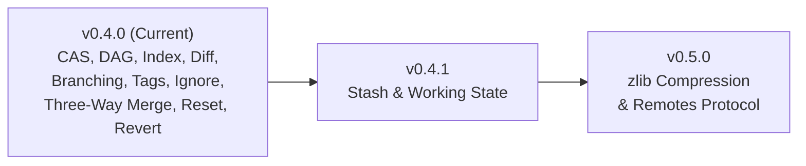

# MiniGit Features & Technical Specification

This document provides a comprehensive, production-grade technical specification of **MiniGit**, covering its command-line interface, underlying subsystems, algorithms, data structures, storage formats, and behavioral semantics.

---

## Table of Contents

- [1. Architecture Overview](#1-architecture-overview)
  - [1.1 Porcelain vs. Plumbing Model](#11-porcelain-vs-plumbing-model)
  - [1.2 Content-Addressable Storage (CAS) Engine](#12-content-addressable-storage-cas-engine)
  - [1.3 The Three-Tree State Model](#13-the-three-tree-state-model)
- [2. Command Reference & Semantics](#2-command-reference--semantics)
  - [2.1 `minigit init`](#21-minigit-init)
  - [2.2 `minigit status`](#22-minigit-status)
  - [2.3 `minigit add`](#23-minigit-add)
  - [2.4 `minigit commit`](#24-minigit-commit)
  - [2.5 `minigit log`](#25-minigit-log)
  - [2.6 `minigit diff`](#26-minigit-diff)
  - [2.7 `minigit branch`](#27-minigit-branch)
  - [2.8 `minigit switch`](#28-minigit-switch)
  - [2.9 `minigit checkout`](#29-minigit-checkout)
  - [2.10 `minigit hash-object`](#210-minigit-hash-object)
  - [2.11 `minigit write-tree`](#211-minigit-write-tree)
  - [2.12 `minigit cat-file`](#212-minigit-cat-file)
  - [2.13 `minigit tag`](#213-minigit-tag)
  - [2.14 `.minigitignore`](#214-minigitignore)
  - [2.15 `minigit reset`](#215-minigit-reset)
  - [2.16 `minigit merge`](#216-minigit-merge)
  - [2.17 `minigit revert`](#217-minigit-revert)
  - [2.18 `minigit stash`](#218-minigit-stash)
- [3. Storage & Object Internals](#3-storage--object-internals)
  - [3.1 Object Envelope Format](#31-object-envelope-format)
  - [3.2 Blob Objects](#32-blob-objects)
  - [3.3 Tree Objects](#33-tree-objects)
  - [3.4 Commit Objects](#34-commit-objects)
  - [3.5 Object Database Sharding](#35-object-database-sharding)
- [4. Staging Engine & Index Specification](#4-staging-engine--index-specification)
  - [4.1 On-Disk Index Format](#41-on-disk-index-format)
  - [4.2 In-Memory Representation](#42-in-memory-representation)
  - [4.3 Path Resolution & Normalization](#43-path-resolution--normalization)
- [5. Diff Engine & LCS Algorithm](#5-diff-engine--lcs-algorithm)
  - [5.1 Longest Common Subsequence Formulation](#51-longest-common-subsequence-formulation)
  - [5.2 CRLF & End-of-Line Handling](#52-crlf--end-of-line-handling)
  - [5.3 Unified Diff Formatter](#53-unified-diff-formatter)
  - [5.4 Diff Operation Modes](#54-diff-operation-modes)
- [6. Reference & Branching Mechanics](#6-reference--branching-mechanics)
  - [6.1 Symbolic References](#61-symbolic-references)
  - [6.2 Detached HEAD Operation](#62-detached-head-operation)
  - [6.3 Branch Safety Constraints](#63-branch-safety-constraints)
- [7. Error Handling & Security](#7-error-handling--security)
- [8. Canonical Git Comparison Matrix](#8-canonical-git-comparison-matrix)
- [9. Future Feature Roadmap](#9-future-feature-roadmap)

---

## 1. Architecture Overview

MiniGit is architected around the core data structures and state transitions of Git. It operates entirely locally without external daemons, relying on filesystem operations and cryptographic hashing.

### 1.1 Porcelain vs. Plumbing Model

Borrowing from standard Git architecture, MiniGit separates commands into two conceptual tiers:

1. **Porcelain Commands:** High-level, user-facing commands designed for daily developer workflows:
   - `init`, `status`, `add`, `commit`, `log`, `diff`, `branch`, `switch`, `checkout`, `tag`, `reset`, `merge`, `revert`, `stash`.
2. **Plumbing Commands:** Low-level commands designed for scriptability, tooling, and granular manipulation of the object database and index:
   - `hash-object`, `write-tree`, `cat-file`.

### 1.2 Content-Addressable Storage (CAS) Engine

Every unit of data in MiniGit (files, directory trees, commit records) is uniquely identified by its cryptographic SHA-256 hash. If two files in different folders or across different commits share the exact same content, MiniGit stores only a single physical object file, guaranteeing deduplication and immutability.

### 1.3 The Three-Tree State Model

MiniGit manages state across three distinct environments:

```text
┌───────────────────────────┐      ┌───────────────────────────┐      ┌───────────────────────────┐
│     WORKING DIRECTORY     │      │       INDEX (STAGING)     │      │        HEAD COMMIT        │
│                           │      │                           │      │                           │
│  Actual physical files    │ ---> │ Cached map of tracked     │ ---> │ Immutable tree snapshot   │
│  on the local filesystem  │ add  │ relative path to blob ID  │commit│ of repository state       │
└───────────────────────────┘      └───────────────────────────┘      └───────────────────────────┘
```

The system continuously tracks deltas between these three trees to report status, produce diffs, and perform safe checkout operations.

---

## 2. Command Reference & Semantics

### 2.1 `minigit init`

#### Synopsis
```bash
minigit init
```

#### Purpose
Initializes a new MiniGit repository in the current working directory or reinitializes an existing one.

#### Behavioral Details
1. Checks whether `.minigit` already exists in the current working directory.
2. Creates the required internal directory hierarchy:
   - `.minigit/objects/`
   - `.minigit/refs/heads/`
   - `.minigit/refs/tags/`
3. Initializes metadata files if not already present:
   - `.minigit/HEAD`: Populated with `ref: refs/heads/main\n`.
   - `.minigit/config`: Empty placeholder for local configuration.
   - `.minigit/index`: Empty staging area.
4. Outputs appropriate confirmation message depending on whether the repository was newly created or reinitialized.

#### Example
```bash
$ minigit init
Initialized empty mini_git repository in C:/dev/project/.minigit/
```

---

### 2.2 `minigit status`

#### Synopsis
```bash
minigit status
```

#### Purpose
Inspects and categorizes the differences between the Working Directory, the Staging Index, and the HEAD commit.

#### Behavioral Details
1. Discovers repository root by traversing upward from the current working directory (`Repository::discover`).
2. Determines the current branch by reading `.minigit/HEAD`:
   - If symbolic ref `ref: refs/heads/<branch>`, extracts `<branch>`.
   - If detached HEAD, reports `HEAD (detached)`.
3. Reads `.minigit/index` into memory.
4. Scans the working tree recursively, excluding `.minigit` and internal hidden directories.
5. Classifies files into 4 categories:
   - **Changes to be committed (Staged):** Files present in the index.
   - **Changes not staged for commit (Modified):** Files in the index whose working tree content produces a different SHA-256.
   - **Changes not staged for commit (Deleted):** Files in the index that no longer exist in the working tree.
   - **Untracked files:** Regular files in the working tree that do not appear in the index.
6. Displays the formatted summary in standard Git color-compatible sections.

#### Example
```bash
$ minigit status
On branch main

Changes to be committed:
	new file:   src/main.cpp
	new file:   README.md

Changes not staged for commit:
	modified:   CMakeLists.txt

Untracked files:
	notes.txt
```

---

### 2.3 `minigit add`

#### Synopsis
```bash
minigit add <file> [<file>...]
```

#### Purpose
Stages changes by storing the file content into the object database as a blob and recording the relative path and blob hash into `.minigit/index`.

#### Behavioral Details
1. For each specified path:
   - Resolves canonical absolute path.
   - Validates that the path is within the repository root (prevents path traversal out of the workspace).
   - Reads file content in binary mode.
   - Generates a `Blob` object: calculates SHA-256 and serializes with the `blob <size>\0` envelope.
   - Writes the blob into `.minigit/objects/`.
   - Updates the in-memory index map (`path -> blob_id`).
2. Persists the updated index to disk (`.minigit/index`).
3. If a path is invalid or missing, outputs an error message and proceeds to process remaining arguments.

#### Example
```bash
$ minigit add src/main.cpp include/header.h
```

---

### 2.4 `minigit commit`

#### Synopsis
```bash
minigit commit -m <message> [--author <author>]
```

#### Purpose
Captures the current state of the staging index as a persistent, immutable commit object and updates the current branch pointer.

#### Flags & Options
- `-m <message>`: *(Required)* The commit message describing changes.
- `--author <author>`: *(Optional)* Author identity. Defaults to `MiniGit User <user@minigit>`.

#### Behavioral Details
1. Validates that the commit message is not empty.
2. Validates that the staging index contains at least one tracked file.
3. **Write Tree:** Constructs a `Tree` object containing all index entries sorted alphabetically, writes it to `.minigit/objects/`, and obtains its tree SHA.
4. **Determine Parentage:** Resolves the current HEAD commit SHA. If HEAD has no commits yet (root commit), parents list is empty. Otherwise, the current commit is assigned as the first parent.
5. **Create Commit:** Constructs a `Commit` object with tree ID, parent IDs, author, message, and current Unix epoch timestamp. Writes it to `.minigit/objects/`.
6. **Update Reference:**
   - If HEAD is a symbolic reference (e.g. `ref: refs/heads/main`), writes the new commit SHA to `.minigit/refs/heads/main`.
   - If HEAD is detached, writes the commit SHA directly into `.minigit/HEAD`.
7. Outputs summary with short 7-character hash, root-commit flag (if applicable), and commit message.

#### Example
```bash
$ minigit commit -m "Implement core hashing routines" --author "Dev <dev@domain.com>"
[7e9a12c] Implement core hashing routines
```

---

### 2.5 `minigit log`

#### Synopsis
```bash
minigit log
```

#### Purpose
Displays the linear commit history starting from the current `HEAD` and traversing backward through first-parent pointers.

#### Behavioral Details
1. Resolves `HEAD` to determine the latest commit SHA. If no commits exist on the branch, exits with a fatal message.
2. Reads each commit object from the object database.
3. Parses commit envelope: extracts tree hash, parent commit hash(es), author name/email, timestamp, and message body.
4. Prints commit header and formatted commit body.
5. Sets `current_sha = parent_sha` and repeats until reaching the root commit (no parent).

#### Example
```bash
$ minigit log
commit 7e9a12cf4603951239c4f4244f7d4bb21a71997d9178ad9902636a04a6ee1039
Author: Dev <dev@domain.com>
Date:   1773322800

    Implement core hashing routines

commit 1a0b3c58342dc2145b20756e4c7ba987e9e6a0d0d4638708c3525287f3942007
Author: MiniGit User <user@minigit>
Date:   1773319200

    Initial repository commit
```

---

### 2.6 `minigit diff`

#### Synopsis
```bash
minigit diff [--cached|--staged] [<path>...]
```

#### Purpose
Computes line-by-line differences using the Longest Common Subsequence (LCS) dynamic programming algorithm, displaying patches in unified diff format.

#### Modes of Operation
1. **Unstaged Changes (default):** Compares files in the **Working Directory** against the **Staging Index**.
2. **Staged Changes (`--cached` or `--staged`):** Compares entries in the **Staging Index** against the **HEAD Commit's Tree**.
3. **Pathspec Filtering (`<path>...`):** Restricts diff output to only files matching the specified path or directory prefix.

#### Output Formatting
- Outputs standard unified diff header:
  - `diff --minigit a/<path> b/<path>`
  - `--- a/<path>` (or `--- /dev/null` for newly added files)
  - `+++ b/<path>` (or `+++ /dev/null` for deleted files)
- Contextual hunk header (`@@ -x,y +x,y @@`).
- Lines prefixed with `+` (additions in green), `-` (deletions in red), or ` ` (matching context).

#### Example
```bash
$ minigit diff
diff --minigit a/src/main.cpp b/src/main.cpp
--- a/src/main.cpp
+++ b/src/main.cpp
@@ -10,3 +10,4 @@
 int main() {
+    std::cout << "Version 1.0\n";
     return 0;
 }
```

---

### 2.7 `minigit branch`

#### Synopsis
```bash
# List branches
minigit branch

# Create branch
minigit branch <branch-name>

# Delete branch
minigit branch -d <branch-name>
```

#### Purpose
Inspects, creates, or deletes branch references under `.minigit/refs/heads/`.

#### Behavioral Details
- **Listing:** Reads all files in `.minigit/refs/heads/`, sorts them lexicographically, and prefixes the currently active branch with `* `.
- **Creation:** Reads the current HEAD commit hash and creates a new reference file `.minigit/refs/heads/<branch-name>` pointing to that hash. Fails if the branch already exists or if HEAD has no commits.
- **Deletion (`-d`):** Removes the reference file `.minigit/refs/heads/<branch-name>`. Refuses to delete the currently checked-out branch.

#### Example
```bash
$ minigit branch feature/parser
Created branch 'feature/parser' at 7e9a12c

$ minigit branch
* main
  feature/parser

$ minigit branch -d feature/parser
Deleted branch feature/parser
```

---

### 2.8 `minigit switch`

#### Synopsis
```bash
# Switch to existing branch
minigit switch <branch>

# Create and switch to new branch
minigit switch -c <new-branch>
```

#### Purpose
Provides a modern, dedicated command for switching branches without risking accidental file overwrites common to overloaded checkout tools.

#### Behavioral Details
- With `-c <new-branch>`: Verifies that the branch does not already exist, resolves the HEAD commit SHA, creates `.minigit/refs/heads/<new-branch>`, and delegates working tree restoration to checkout.
- Without `-c`: Validates that `.minigit/refs/heads/<branch>` exists and switches to it.

#### Example
```bash
$ minigit switch -c develop
Created branch 'develop' at 7e9a12c
Switched to branch 'develop'
```

---

### 2.9 `minigit checkout`

#### Synopsis
```bash
minigit checkout <branch-or-commit-sha>
```

#### Purpose
Restores the working directory files and staging index to match the target commit or branch head.

#### Behavioral Details
1. **Target Resolution:**
   - Checks if `<target>` corresponds to `.minigit/refs/heads/<target>`. If so, target is a branch (`is_branch = true`).
   - Otherwise, treats `<target>` as a direct commit SHA (`is_branch = false`).
2. **Object Lookup:** Reads the commit object and parses its tree root hash, then retrieves and parses the `Tree` object.
3. **Working Tree Restoration:** Iterates through every entry in the tree, retrieves blob content from `.minigit/objects/`, strips the object header, and writes the exact bytes to the corresponding file on disk (creating parent directories as needed).
4. **Index Synchronization:** Clears and reconstructs `.minigit/index` with the exact paths and hashes from the restored tree.
5. **Update HEAD:**
   - If target was a branch: writes `ref: refs/heads/<branch>\n` to `.minigit/HEAD`.
   - If target was a commit: writes `<commit-sha>\n` to `.minigit/HEAD` (detached HEAD state).

#### Example
```bash
$ minigit checkout main
Switched to branch 'main'

$ minigit checkout 1a0b3c58342dc2145b20756e4c7ba987e9e6a0d0d4638708c3525287f3942007
HEAD is now at 1a0b3c5 Initial repository commit
```

---

### 2.10 `minigit hash-object`

#### Synopsis
```bash
minigit hash-object [-w] <file>
```

#### Purpose
Plumbing command that computes the SHA-256 hash of a file as a blob object, optionally writing it into `.minigit/objects/`.

#### Flags
- `-w`: Persists the generated blob object into the object database.

#### Example
```bash
$ minigit hash-object test.txt
487b32f9bf2dd4f923b77382025e6834164b85c18a204620f4c3de436894c77c

$ minigit hash-object -w test.txt
487b32f9bf2dd4f923b77382025e6834164b85c18a204620f4c3de436894c77c
```

---

### 2.11 `minigit write-tree`

#### Synopsis
```bash
minigit write-tree
```

#### Purpose
Plumbing command that takes the current contents of `.minigit/index` and writes a `Tree` object to the object store, returning its SHA-256 hash.

#### Behavioral Details
1. Reads entries from `.minigit/index`.
2. Fails if index is empty.
3. Sorts entries and encodes each entry into `100644 <path> <sha256>\n`.
4. Writes the serialized tree object to `.minigit/objects/`.
5. Prints the resulting 64-character SHA-256 to stdout.

#### Example
```bash
$ minigit write-tree
9e5c46b9a89d1469e5f583856b3e34b9b4bc0a2b083b4827051a89c938be985e
```

---

### 2.12 `minigit cat-file`

#### Synopsis
```bash
minigit cat-file (-t | -s | -p) <object-sha>
```

#### Purpose
Plumbing command for inspecting any object stored in the object database. It is the read-side counterpart to `hash-object` and `write-tree`, providing direct access to stored blob, tree, and commit data without going through higher-level porcelain commands.

#### Flags
| Flag | Meaning |
| :--- | :--- |
| `-t` | Print the **type** of the object (`blob`, `tree`, or `commit`). |
| `-s` | Print the **size** in bytes of the object body (i.e. the payload after the null-byte header delimiter). |
| `-p` | **Pretty-print** the object body in a human-readable format appropriate for the object type. |

Exactly one flag must be specified along with a valid 64-character SHA-256 hex string.

#### Behavioral Details
1. Constructs the object path from the SHA: `.minigit/objects/<first-2-hex-chars>/<remaining-62-hex-chars>`.
2. Reads the raw bytes from disk (as stored by `ObjectDatabase::write`).
3. Parses the envelope header (`<type> <size>\0<body>`) to extract type, size, and body.
4. Dispatches based on flag:
   - **`-t`:** Extracts and prints the type token from the header.
   - **`-s`:** Extracts and prints the decimal size field from the header.
   - **`-p`:** Delegates to a type-specific pretty-printer:
     - **Blob:** Writes the raw body bytes directly to stdout.
     - **Tree:** Calls `parse_tree()` and formats each entry as `<mode> <type> <sha>    <name>`.
     - **Commit:** Calls `parse_commit()` and formats as `tree`/`parent`/`author`/`committer` headers followed by a blank line and the commit message.

#### Output Format — Pretty-Print by Type

**Blob:**
```text
<raw file content, byte-for-byte>
```

**Tree:**
```text
100644 blob 487b32f9bf2dd4f923b77382025e6834164b85c18a204620f4c3de436894c77c    hello.txt
100644 blob 9b2d8f1430fca6834b6807d4bdf882800d0eb8b63e8a719c8d50b28e678bf43e    app.conf
```

**Commit:**
```text
tree e3b0c44298fc1c149afbf4c8996fb92427ae41e4649b934ca495991b7852b855
parent 7e9a12cf4603951239c4f4244f7d4bb21a71997d9178ad9902636a04a6ee1039
author MiniGit User <user@minigit> 1773322800
committer MiniGit User <user@minigit> 1773322800

Initial commit with configuration and hello
```

#### Example
```bash
$ SHA=$(minigit hash-object -w notes.txt)

$ minigit cat-file -t $SHA
blob

$ minigit cat-file -s $SHA
42

$ minigit cat-file -p $SHA
Meeting notes for the project kickoff...

# Inspect a tree or commit found via log
$ COMMIT=$(cat .minigit/refs/heads/main)
$ minigit cat-file -t $COMMIT
commit

$ minigit cat-file -p $COMMIT
tree bf1d2a71cd66ce7408912bf96e4c655466158621b9c1bf1de5e90013f6bb943e
author MiniGit User <user@minigit> 1789218576
committer MiniGit User <user@minigit> 1789218576

initial commit
```

---

### 2.13 `minigit tag`

#### Synopsis
```bash
# List all tags
minigit tag

# Create a lightweight tag at HEAD
minigit tag <name>

# Create an annotated tag at HEAD
minigit tag -a <name> -m <message>

# Delete a tag
minigit tag -d <name>
```

#### Purpose
Tag references mark specific commits as named milestones. MiniGit supports two tag types matching canonical Git semantics:

- **Lightweight tags** — a named pointer file in `refs/tags/` containing a commit SHA, identical in structure to branch refs.
- **Annotated tags** — a first-class object stored in the object database, carrying tagger identity, timestamp, and an annotation message. The `refs/tags/` file points to the tag object SHA, not directly to the commit.

#### Flags
| Flag | Meaning |
| :--- | :--- |
| *(none)* | List all tags sorted lexicographically. |
| `<name>` | Create a lightweight tag at HEAD. |
| `-a <name> -m <message>` | Create an annotated tag object and store it. |
| `-d <name>` | Delete the tag reference. |

#### Annotated Tag Object Format
```text
tag <body-size>\0object <commit-sha>
type commit
tag <name>
tagger <tagger-name-and-email> <unix-timestamp>

<annotation-message>
```
The SHA-256 of the full envelope is stored as the tag-object ID; `refs/tags/<name>` points to this ID. `cat-file -t` reports `tag`; `cat-file -p` pretty-prints the body.

#### Behavioral Details
1. **List:** Reads all files under `.minigit/refs/tags/`, sorts lexicographically, and prints one tag name per line.
2. **Lightweight create:** Resolves HEAD commit SHA, writes it to `.minigit/refs/tags/<name>`. Fails if the tag already exists or HEAD has no commits.
3. **Annotated create:** Builds a tag body string, prepends the `tag <size>\0` envelope, computes SHA-256, writes to `ObjectDatabase`, and stores the tag-object SHA in `refs/tags/<name>`.
4. **Delete:** Removes `.minigit/refs/tags/<name>`. Errors if not found.

#### Example
```bash
$ minigit tag v1.0
$ minigit tag -a v1.0-release -m "Stable release"
$ minigit tag
v1.0
v1.0-release

$ minigit cat-file -t $(cat .minigit/refs/tags/v1.0-release)
tag

$ minigit cat-file -p $(cat .minigit/refs/tags/v1.0-release)
object 36358f8b0b23497bdf2c3daa925c2c51cd5329a36822e2a2ac8d50d2facee6f7
type commit
tag v1.0-release
tagger MiniGit User <user@minigit> 1773322800

Stable release

$ minigit tag -d v1.0
Deleted tag v1.0
```

---

### 2.14 `.minigitignore`

#### Synopsis
Place a `.minigitignore` file in the repository root (next to `.minigit/`). MiniGit reads it automatically during `status` and `add`.

#### Purpose
Prevents certain files from appearing in `status` untracked output and blocks `add` from staging them. Mirrors the semantics of `.gitignore` for the supported subset of patterns.

#### Pattern Syntax
| Syntax | Meaning |
| :--- | :--- |
| `*.ext` | Ignores all files with that extension (basename match). |
| `dirname/` | Ignores the named directory and all its contents. |
| `path/to/file` | Ignores a specific rooted path (pattern contains `/`). |
| `!pattern` | Un-ignores (negates) a previously matched path. |
| `# comment` | Line is ignored. |
| *(blank line)* | Skipped. |

#### Matching Rules
1. **Non-rooted patterns** (no `/` in pattern, no trailing `/`): matched against the **filename** (basename) of each path. Also propagated to match children if the pattern matches a directory component.
2. **Directory patterns** (trailing `/`): matched against each ancestor directory component of the path, ignoring all contained files.
3. **Rooted patterns** (contains `/` after stripping leading `!`): matched against the **full relative path** from the repository root.
4. **Negation** (`!`): if a rule's pattern matches but the rule is negated, the file's ignored state is flipped back to "not ignored". Rules are processed in order; the last match wins.
5. Glob characters:
   - `*` — matches any sequence of characters that does **not** include `/`.
   - `?` — matches exactly one character that is **not** `/`.

#### Integration Points
- **`minigit status`:** `working_tree_files()` skips any path for which `IgnoreRules::is_ignored()` returns `true`. `.minigitignore` itself is also silently excluded from the untracked list (it is a configuration file, not project content).
- **`minigit add`:** Before staging, if `is_ignored()` returns `true` and the file is not already in the index, emits `warning: ignoring '<path>' (matched by .minigitignore)` and skips. Files already tracked in the index bypass the ignore check (consistent with git behavior).

#### Example `.minigitignore`
```text
# Build artifacts
build/
*.o
*.exe

# Logs (except crash logs)
*.log
!crash.log

# IDE metadata
.vscode/
.cache/
```

---

### 2.15 `minigit reset`

#### Synopsis
```bash
# Mixed reset (default): move HEAD and reset index
minigit reset <commit-or-branch>
minigit reset --mixed <commit-or-branch>

# Soft reset: move HEAD only
minigit reset --soft <commit-or-branch>

# Hard reset: move HEAD, reset index, and restore working tree
minigit reset --hard <commit-or-branch>
```

#### Purpose
Rolls back the current branch head (or detached HEAD) to a target commit or branch, with three distinct levels of impact on the staging area (index) and the working tree:

- **`--soft`**: Updates only the reference pointed to by `HEAD` (or `HEAD` itself if detached). The staging area (index) and working directory remain completely untouched. Changes from undone commits appear as staged changes (`Changes to be committed`).
- **`--mixed` (default)**: Updates the reference pointed to by `HEAD` and resets the staging area (`.minigit/index`) to match the target commit's tree snapshot. The working tree files remain untouched. Changes appear as unstaged modifications in `status` and `diff`.
- **`--hard`**: Updates the reference pointed to by `HEAD`, resets the staging area, and overwrites all tracked working tree files to match the exact contents of the target commit. **Warning:** Any uncommitted modifications to tracked files are permanently discarded.

#### Flags
| Flag | Meaning |
| :--- | :--- |
| `--soft` | Moves HEAD/branch pointer only. Index and working tree are preserved. |
| `--mixed` | *(Default)* Moves HEAD/branch pointer and resets the index to match the target tree. Working tree is preserved. |
| `--hard` | Moves HEAD/branch pointer, resets the index, and restores working tree files from object storage. |

#### Behavioral Details
1. **Revision Resolution:** Resolves `<target>` as a branch ref (`refs/heads/<target>`), tag ref (`refs/tags/<target>`), or raw commit SHA. Validates that the target object exists and is a commit.
2. **Read Tree:** Parses the commit object to retrieve its associated `tree` SHA, then loads all entries from the `Tree` object.
3. **Reference Update:**
   - If `HEAD` is a symbolic reference (e.g. `ref: refs/heads/main`), updates `.minigit/refs/heads/main` to the target commit SHA.
   - If `HEAD` is detached, updates `.minigit/HEAD` directly.
4. **Index Synchronization (`--mixed` and `--hard`):**
   - Clears and reconstructs `.minigit/index` with the paths and blob SHAs from the target commit's tree.
5. **Working Tree Restoration (`--hard` only):**
   - For every entry in the target tree, retrieves the blob payload from `.minigit/objects/`, strips the header, and writes the contents to disk (creating directories as necessary).
6. **Reporting:** Prints current commit summary (short SHA + message) and, for `--mixed`, lists the unstaged modifications.

#### Example
```bash
# Undo the last commit, keeping all changes staged
$ minigit reset --soft HEAD~1

# Undo the last commit and unstage changes (default)
$ minigit reset HEAD~1

# Discard all changes and completely revert working tree to a milestone commit
$ minigit reset --hard 5b2f8a1
HEAD is now at 5b2f8a1 Initial commit with configuration and hello
```

---

### 2.16 `minigit merge`

#### Synopsis
```bash
minigit merge <branch> [--author <author>]
```

#### Purpose
Performs a three-way merge of `<branch>` into the currently checked-out branch. If the current branch is an ancestor of `<branch>`, performs a fast-forward merge. Otherwise, locates the Lowest Common Ancestor (LCA) merge base across the commit DAG and performs line-level three-way merging. If conflicting edits are encountered, conflict markers (`<<<<<<<`, `=======`, `>>>>>>>`) are inserted into the files for manual resolution. On a clean merge, an automated merge commit with two parents is created.

#### Flags & Options
- `<branch>`: *(Required)* Name of the target branch to merge into current HEAD.
- `--author <author>`: *(Optional)* Author identity for the merge commit. Defaults to `MiniGit User <user@minigit>`.

#### Behavioral Details
1. **Repository Discovery & Preconditions:**
   - Validates that the repository exists and HEAD contains at least one commit.
   - Verifies that `<branch>` exists under `.minigit/refs/heads/<branch>` and has at least one commit.
   - If current HEAD SHA equals target branch SHA, exits immediately with `Already up to date.`.
2. **Merge Base (LCA) Computation:**
   - Traverses the commit DAG backward using a two-phase Breadth-First Search (BFS) / reachability paint algorithm (`find_merge_base`).
   - Identifies the shallowest common ancestor commit SHA between `HEAD` and `<branch>`.
3. **Fast-Forward Detection:**
   - If `merge_base == HEAD_sha`: HEAD is a direct ancestor of `<branch>`. Fast-forwards by advancing the current branch ref directly to `<branch>` SHA, restoring files in the working tree, updating `.minigit/index`, and outputting `Fast-forward`.
   - If `merge_base == branch_sha`: Current HEAD already contains all history from `<branch>`. Reports `Already up to date.` and exits.
4. **Three-Way File Merging (`three_way_merge`):**
   - Retrieves the tree snapshots for `base`, `ours` (current branch), and `theirs` (`<branch>`).
   - Computes the union of all file paths across the three trees.
   - For each path:
     - If both sides match identically, the file is retained.
     - If added or modified only by one side relative to `base`, accepts the modified side.
     - If deleted by one side and unmodified by the other, accepts deletion.
     - If modified by both sides: splits contents into lines and aligns them against `base` using LCS edit sequences (`lcs_diff`).
     - If changes are disjoint or identical, automatically merges without conflict.
     - If overlapping lines or contradictory changes exist, inserts Git-compatible conflict markers:
       ```text
       <<<<<<< <ours>
       ... our lines ...
       =======
       ... their lines ...
       >>>>>>> <theirs>
       ```
5. **Conflict Handling:**
   - If any file encounters a conflict, writes the conflict-marked content to disk, updates the index with the conflict blob, emits `CONFLICT (content): Merge conflict in <file>`, and exits with non-zero status code: `Automatic merge failed; fix conflicts and then commit the result.`.
6. **Merge Commit Creation:**
   - On a clean merge (no conflicts), writes a new `Tree` object from the merged index entries.
   - Constructs a `Commit` object with **two parents**: `[our_sha, their_sha]`.
   - Formats the commit message as `Merge branch '<branch>' into <our_branch>`.
   - Advances the active branch reference to the new merge commit.
   - Outputs summary: `Merge made by the 'recursive' strategy.` and `[<short-sha>] <message>`.

#### Example
```bash
# On branch main, merge feature/parser
$ minigit merge feature/parser
Merge made by the 'recursive' strategy.
[5d24932] Merge branch 'feature/parser' into main

# In case of conflicts:
$ minigit merge feature/conflict
CONFLICT (content): Merge conflict in src/parser.cpp

Automatic merge failed; fix conflicts and then commit the result.
```

---

### 2.17 `minigit revert`

#### Synopsis
```bash
minigit revert <commit> [--author <author>]
```

#### Purpose
Inverses the changes introduced by `<commit>` by creating a new commit on top of current HEAD. Unlike `reset`, which alters existing branch history, `revert` is non-destructive and safe for shared branches because it linearly advances HEAD with an inverse diff.

#### Flags & Options
- `<commit>`: *(Required)* Commit SHA, branch name, or tag reference to revert.
- `--author <author>`: *(Optional)* Author identity for the revert commit. Defaults to `MiniGit User <user@minigit>`.

#### Behavioral Details
1. **Target Commit Resolution:**
   - Resolves `<commit>` through branches (`refs/heads/`), tags (`refs/tags/`), or raw commit SHAs.
   - Reads and validates that the target object is a commit.
2. **Three-Way Inverse Merge Model:**
   - Evaluates the commit DAG to establish three distinct tree roles:
     - **Base Tree:** The tree snapshot of `<commit>` being reverted.
     - **Ours Tree:** The tree snapshot of the current `HEAD`.
     - **Theirs Tree:** The tree snapshot of `<commit>`'s first parent (the state immediately prior to the reverted commit). If the reverted commit is a root commit, the parent tree is considered empty.
   - Leverages `three_way_merge` across the union of all paths across these three trees:
     - Files added by `<commit>` are removed from the working tree and index.
     - Files deleted by `<commit>` are restored from the parent tree.
     - Files modified by `<commit>` have their edits reversed line-by-line using the LCS diff engine.
     - Files changed in other subsequent commits or untouched by `<commit>` pass through safely.
3. **Conflict Detection & Markers:**
   - If subsequent changes on `HEAD` overlap or conflict with the inverse edits, standard conflict markers are inserted into the files:
     ```text
     <<<<<<< <branch>
     ... current content ...
     =======
     ... reverted parent content ...
     >>>>>>> parent of <commit-short-sha>
     ```
   - Emits `CONFLICT (content): Merge conflict in <file>` and aborts with `Automatic revert failed; fix conflicts and then commit the result.`.
4. **Commit Creation:**
   - Upon clean application, updates the index and writes a new `Tree` object.
   - Creates a new single-parent commit with message `Revert "<original-commit-message>"`.
   - Advances the active branch pointer or detached HEAD to the new revert commit.

#### Example
```bash
# Revert a faulty commit by SHA
$ minigit revert 0f2c6f9
[f00c6db] Revert "add line4 and change line1"

# Inspect history to confirm linear advancement
$ minigit log
commit f00c6db6332cd7751e885bd79024b7ced5ec7985c8d1d9a8f2e4d18a46957ec1
Author: MiniGit User <user@minigit>
Date:   1789294717

    Revert "add line4 and change line1"
```

---

### 2.18 `minigit stash`

#### Synopsis
```bash
minigit stash [push]
minigit stash list
minigit stash pop   [stash@{N}]
minigit stash drop  [stash@{N}]
minigit stash show  [stash@{N}]
```

#### Purpose
Temporarily shelves all uncommitted changes from both the working directory and the staging index, allowing the developer to switch context (e.g., check out a different branch, apply a hotfix) and later restore the shelved state without making a commit.

#### Behavioral Details

**`push` (default subcommand)**
1. Resolves the current HEAD commit. Aborts if no commits exist yet.
2. Recursively scans the working directory (honouring `.minigitignore`, skipping `.minigit`), computes a `Blob` SHA-256 for every encountered file, and compares it against the HEAD tree.
3. If no file differs from HEAD, prints `No local changes to save` and exits cleanly.
4. Stores all blobs in the CAS object database (idempotent no-op for already-present objects).
5. Assembles a `Tree` object from the working-directory snapshot and persists it.
6. Creates a stash `Commit` object with:
   - `tree`: the working-directory snapshot tree
   - `parent`: `{HEAD commit SHA}` (single parent)
   - `author`: `MiniGit User <user@minigit>`
   - `message`: `WIP on <branch>: <sha7> <head-message>`
7. **Prepends** the new stash commit SHA to `.minigit/stash` (index 0 = most recent).
8. Resets the index to exactly match the HEAD tree (equivalent to `reset --mixed`).
9. Restores all working-directory files tracked by HEAD to their committed content (equivalent to `reset --hard`).
10. Prints: `Saved working directory and index state <message>`

**`list`**
- Reads `.minigit/stash` line by line.
- For each SHA, parses the stash commit's `message` field.
- Prints each entry numbered from 0 (most recent):
  ```
  stash@{0}: WIP on main: abc1234 Add feature
  stash@{1}: WIP on main: def5678 Fix bug
  ```
- Prints nothing if the stash is empty (same behaviour as `git stash list`).

**`pop [stash@{N}]`** *(default: `stash@{0}`)*
1. Parses N from `stash@{N}`.
2. Reads entry N from `.minigit/stash`; errors if the index is out of bounds.
3. Parses the stash commit's tree from the object database.
4. Writes every file in the stash tree to the working directory (creating directories as needed).
5. Resets the index to exactly match the stash tree.
6. Removes entry N from `.minigit/stash`.
7. Prints: `Dropped stash@{N} (<sha7>)`

**`drop [stash@{N}]`** *(default: `stash@{0}`)*
1. Reads entry N from `.minigit/stash`; errors if out of bounds.
2. Removes that entry from the stash list **without** touching the working directory or index.
3. Prints: `Dropped stash@{N} (<sha7>)`

**`show [stash@{N}]`** *(default: `stash@{0}`)*
- Reads the stash commit's tree.
- Prints a file summary: `<mode> <sha7> <name>` for each tree entry, one per line.

#### Storage Layout
```text
.minigit/
  stash                        ← plain text; one stash-commit SHA per line (most-recent first)
  objects/<2-char-prefix>/<62-char-suffix>  ← stash tree + commit stored as CAS objects
```

#### Stash Commit Object Structure
```text
commit <size>\0
tree   <tree-sha>
parent <head-sha>
author MiniGit User <user@minigit> <unix-timestamp>

WIP on <branch>: <sha7> <head-message>
```

#### Example
```bash
# Make some changes
$ echo "work in progress" >> src/main.cpp

# Stash them
$ minigit stash
Saved working directory and index state WIP on main: 62732d2 docs: document 'revert' command

# Confirm clean state
$ minigit status
On branch main

nothing to commit, working tree clean

# List the stash
$ minigit stash list
stash@{0}: WIP on main: 62732d2 docs: document 'revert' command

# Show what was stashed
$ minigit stash show
100644 a3f8c12 src/main.cpp

# Restore the stash
$ minigit stash pop
Dropped stash@{0} (abc1234)
```

---

## 3. Storage & Object Internals

### 3.1 Object Envelope Format

Every object stored in `.minigit/objects/` adheres to a strict canonical envelope format:

```text
+------+---+------+----+---------------+
| type |   | size | \0 |    payload    |
+------+---+------+----+---------------+
```

- **`type`:** ASCII string identifier (`blob`, `tree`, or `commit`).
- **` `:** A single ASCII space character (`0x20`).
- **`size`:** Decimal ASCII representation of payload size in bytes.
- **`\0`:** Null byte delimiter (`0x00`).
- **`payload`:** Raw object bytes.

The SHA-256 ID of an object is computed over the entire envelope (header + null byte + payload).

### 3.2 Blob Objects

Blobs represent raw file contents without filename, path, or permissions metadata.
- **Header:** `blob <payload-size>\0`
- **Payload:** Exact binary bytes of the file.

### 3.3 Tree Objects

Trees represent directory snapshots.
- **Header:** `tree <payload-size>\0`
- **Payload:** One line per entry, sorted lexicographically by filename:
  ```text
  <mode> <name> <sha256>\n
  ```
  - `mode`: File permission mode string (e.g. `100644` for regular files).
  - `name`: Relative file or directory name.
  - `sha256`: 64-character lowercase hex SHA-256 hash.

### 3.4 Commit Objects

Commits represent immutable checkpoints in repository history.
- **Header:** `commit <payload-size>\0`
- **Payload:** Formatted key-value headers separated from the commit message by a blank line:
  ```text
  tree <tree-sha256>
  parent <parent-sha256>
  author <author-name-and-email> <unix-timestamp>
  committer <author-name-and-email> <unix-timestamp>

  <commit-message>
  ```

### 3.5 Object Database Sharding

To prevent filesystem performance degradation due to thousands of files in a single directory, MiniGit shards objects:
- Directory: `.minigit/objects/<first-2-hex-chars>/`
- Filename: `<remaining-62-hex-chars>`
- Total path length: 64-character hash split into `2 / 62`.

---

## 4. Staging Engine & Index Specification

### 4.1 On-Disk Index Format

The staging index resides at `.minigit/index`. Unlike standard Git's complex binary DIRC format, MiniGit uses a clean, line-delimited format:

```text
<relative-path> <blob-sha256>\n
```

Example `.minigit/index`:
```text
CMakeLists.txt 9b2d8f1430fca6834b6807d4bdf882800d0eb8b63e8a719c8d50b28e678bf43e
src/main.cpp 4a5e1e5823ca8789bc451bdf626c920bf05b63bc2d603a1198642013f26ca514
```

### 4.2 In-Memory Representation

In memory, the index is loaded into an `std::unordered_map<std::string, std::string>` mapping relative paths to blob SHA-256 strings, providing $O(1)$ lookups and stage operations.

### 4.3 Path Resolution & Normalization

All paths added to the index are converted into paths relative to the repository root. Paths containing directory traversal sequences (such as `../`) that point outside the repository boundary are rejected with an explicit error.

---

## 5. Diff Engine & LCS Algorithm

### 5.1 Longest Common Subsequence Formulation

MiniGit calculates diffs using dynamic programming LCS across line arrays:
Given sequences $A = [a_1, \dots, a_m]$ and $B = [b_1, \dots, b_n]$:

$$
\text{DP}[i][j] =
\begin{cases}
0 & \text{if } i = 0 \text{ or } j = 0 \\
\text{DP}[i-1][j-1] + 1 & \text{if } A[i-1] = B[j-1] \\
\max(\text{DP}[i-1][j], \text{DP}[i][j-1]) & \text{if } A[i-1] \ne B[j-1]
\end{cases}
$$

After constructing the matrix, an iterative backtrack traverses backwards from $(m, n)$ to $(0, 0)$ producing edits tagged as `Keep`, `Add`, or `Remove`.

### 5.2 CRLF & End-of-Line Handling

To maintain cross-platform fidelity on Windows and Unix:
- `split_lines()` strips trailing `\r` carriage returns from lines before comparison.
- Trailing newline anomalies at end-of-file are normalized to avoid spurious blank-line edits.

### 5.3 Unified Diff Formatter

The edit vector is formatted into hunks with context lines:
- Groups edits into hunks bounded by matching context lines.
- Generates `@@ -start,length +start,length @@` range coordinates.
- Prepends `+` to added lines, `-` to deleted lines, and ` ` to context lines.

### 5.4 Diff Operation Modes

| Mode | Invocation | Old Source | New Source |
| :--- | :--- | :--- | :--- |
| **Unstaged** | `minigit diff` | Blob in `.minigit/index` | File in Working Directory |
| **Staged** | `minigit diff --cached` | Blob in HEAD commit's tree | Blob in `.minigit/index` |
| **Deleted** | `minigit diff` | Blob in `.minigit/index` | `/dev/null` |

---

## 6. Reference & Branching Mechanics

### 6.1 Symbolic References

When on an active branch, `.minigit/HEAD` contains a symbolic pointer:
```text
ref: refs/heads/main
```
All commits created while on this branch update the target file (`.minigit/refs/heads/main`) rather than modifying `HEAD` directly.

### 6.2 Detached HEAD Operation

When `minigit checkout <commit-sha>` is invoked with a commit SHA:
1. `.minigit/HEAD` is overwritten with the raw 64-character hex hash of that commit.
2. Subsequent commits will advance `HEAD` directly, creating anonymous history not attached to any named branch.
3. Switching back to a branch reattaches HEAD to `ref: refs/heads/<branch>`.

### 6.3 Branch Safety Constraints

- **Active Branch Protection:** Attempting to delete the currently checked-out branch via `minigit branch -d <branch>` is prevented with an informative error.
- **Duplicate Prevention:** Creating a branch that already exists is rejected.
- **Empty HEAD Protection:** Branch creation is blocked if the repository has no commits yet.

---

## 7. Error Handling & Security

1. **Repository Discovery:** Commands dynamically discover the repository boundary by traversing upwards from the current directory. If no `.minigit` directory is encountered before reaching the filesystem root, the process exits with `fatal: not a minigit repository`.
2. **Directory Traversal Protection:** Relative paths supplied to `minigit add` are resolved to absolute paths and verified to lie within `repo.root()`. Files outside the repository yield `error: '<path>' is outside repository`.
3. **Atomic File Updates:** Branch updates and index writes use truncation modes and full buffer flushes to minimize index corruption.
4. **Exception Containment:** Subsystem exceptions (`std::runtime_error`) are caught at command boundaries and transformed into clean, readable CLI error messages.

---

## 8. Canonical Git Comparison Matrix

| Feature / Behavior | MiniGit | Canonical Git |
| :--- | :--- | :--- |
| **Implementation Language** | C++20 | C, POSIX Shell, Perl |
| **Hashing Algorithm** | SHA-256 (64 hex characters) | SHA-1 (legacy default) / SHA-256 |
| **Object Header** | `<type> <size>\0<content>` | `<type> <size>\0<content>` |
| **Object Compression** | Uncompressed loose objects | zlib deflate compression |
| **Packfiles (`.pack`)** | Roadmap | Full support (delta compression) |
| **Plumbing Commands** | `hash-object`, `write-tree`, `cat-file` | `hash-object`, `write-tree`, `cat-file`, `ls-tree`, `ls-files`, and many more |
| **Index Serialization** | Human-readable `<path> <sha256>` | Binary DIRC structure with stat cache |
| **Diff Engine** | LCS DP Matrix | Eugene Myers $O(ND)$ Difference Algorithm |
| **Symbolic HEAD Ref** | Supported (`ref: refs/heads/...`) | Supported (`ref: refs/heads/...`) |
| **Detached HEAD** | Supported | Supported |
| **Branch Deletion Safeguard** | Prevents active branch deletion | Prevents active branch deletion |
| **Cross-Platform CRLF** | Normalizes `\r` across comparisons | Handled via `core.autocrlf` |

---

## 9. Future Feature Roadmap

The following features are scheduled for subsequent versions:



1. ~~**`.minigitignore` Pattern Matching:** Glob matching and directory exclusion during recursive `status` and `add` operations.~~ ✅ **Implemented in v0.2.0**
2. ~~**Tag References (`refs/tags/`):** Lightweight and annotated tags.~~ ✅ **Implemented in v0.2.0**
3. ~~**Three-Way Merge Engine:** Lowest Common Ancestor (LCA) merge-base computation with conflict markers.~~ ✅ **Implemented in v0.3.0**
4. ~~**History Rewriting & Undo (`reset`, `revert`):** Rollback index/working tree and history-safe commit inversion.~~ ✅ **Implemented in v0.4.0**
5. **Object Compression:** Deflate compression for `.minigit/objects/` loose files using zlib.
6. **Remote Protocols:** Push, pull, and clone mechanisms over local filesystems and HTTP.
