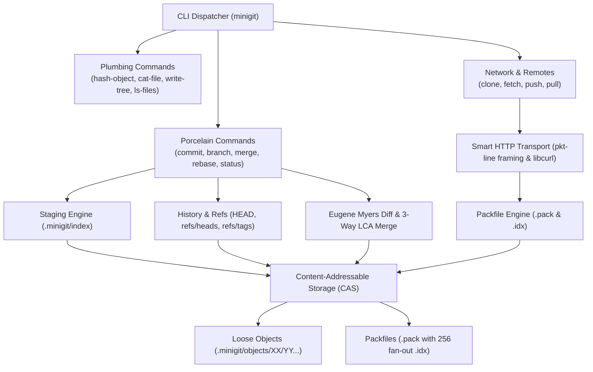

# MiniGit — Git-Compatible Version Control System in C++20

[](https://en.cppreference.com/w/cpp/20)
[](https://cmake.org/)
[](https://www.openssl.org/)
[](https://zlib.net/)
[](https://curl.se/libcurl/)
[](#platform-support--binaries)
[](https://github.com/sagarkrjha/minigit/releases)
[](https://github.com/sagarkrjha/minigit)

**MiniGit** is a lightweight, educational, yet architecturally authentic distributed version control system built from scratch in modern **C++20**. Designed as a clean-room behavioral recreation of Git internals, it implements content-addressable object storage, DAG commit histories, a two-phase staging index, dynamic programming diff calculation, packfile delta compression, and network transport synchronization.

---

## Table of Contents

- [What is MiniGit?](#what-is-minigit)
- [Why MiniGit?](#why-minigit)
- [Key Capabilities](#key-capabilities)
- [Technical Highlights & Architecture](#technical-highlights--architecture)
- [Platform Support & Binaries](#platform-support--binaries)
- [Quick Start](#quick-start)
- [Documentation Directory](#documentation-directory)
- [Source Code Organization](#source-code-organization)
- [Contributing](#contributing)
- [License](#license)

---

## What is MiniGit?

MiniGit is a standalone, Git-compatible command-line version control tool written in C++20. It models the core concepts that define Git:

- **Content-Addressable Storage (CAS):** Immutable objects (blobs, trees, commits, tags) addressed by cryptographic hashes using SHA-256 via OpenSSL.
- **Directed Acyclic Graph (DAG):** Commit history graphs traversed via parent pointer hashes.
- **Two-Phase Staging Index:** Decoupled working-tree caching and atomic snapshot creation.
- **Dynamic Programming Diffs:** Line-level differences computed via Eugene Myers' $O(ND)$ difference algorithm.
- **Wire-Compatible Transport:** Git Smart HTTP v1 client implementation over HTTP/HTTPS with pkt-line packet framing.

---

## Why MiniGit?

Canonical Git comprises decades of accumulated C code, POSIX shell scripts, and complex packfile heuristics that can obscure the foundational computer science principles beneath.

MiniGit was created to:
1. **Demystify Git Internals:** Offer a readable, clean-room C++20 codebase demonstrating how DAGs, content-addressable storage, trees, and staging indexes work in practice.
2. **Prioritize Cryptographic Modernity:** Adopt SHA-256 natively throughout the CAS object model and pack index tables.
3. **Provide Deterministic Performance:** Bound packfile delta chains to single-depth ($O(1)$ unpack time) and flatten commit trees to eliminate recursive tree-of-trees pointer chasing.
4. **Deliver Native Multi-Platform Support:** Ship standalone zero-dependency executables for Windows, Linux, and macOS.

---

## Key Capabilities

| Capability | High-Level Description | Canonical Documentation |
| :--- | :--- | :--- |
| **Repository Lifecycle** | `init`, `status`, `add`, `commit`, `log`, `show`, `clean` | [USAGE.md](USAGE.md#2-daily-development-workflow) |
| **Branching & HEAD** | `branch`, `switch`, `checkout` (with detached HEAD) | [USAGE.md](USAGE.md#3-branching--switching) |
| **Tags & Releases** | Lightweight and annotated tags as first-class objects | [USAGE.md](USAGE.md#4-milestones--releases-minigit-tag) |
| **Merging & History** | 3-way LCA merge, `reset`, `revert`, `cherry-pick`, `rebase` | [USAGE.md](USAGE.md#5-merging--conflict-resolution-minigit-merge) |
| **Shelving & Stash** | Working-tree and index shelving (`stash push/list/pop/drop`) | [USAGE.md](USAGE.md#7-shelving-work-with-stash-minigit-stash) |
| **Linked Worktrees** | Multiple linked working directories sharing central CAS | [USAGE.md](USAGE.md#8-multiple-working-trees-minigit-worktree) |
| **Nested Submodules** | Mode `160000` gitlinks, `.minigitmodules`, recursive sync | [USAGE.md](USAGE.md#9-submodules-minigit-submodule) |
| **Binary Search Debugging** | Automated and interactive DAG bisection (`bisect run`) | [USAGE.md](USAGE.md#10-binary-search-debugging-minigit-bisect) |
| **Network & Remotes** | `clone`, `fetch`, `push`, `pull` via Git Smart HTTP v1 | [USAGE.md](USAGE.md#11-remote-repositories--synchronization) |
| **Storage & Packing** | Packfile v2, idx v2, delta compression (`repack`, `verify-pack`) | [docs/ARCHITECTURE.md](docs/ARCHITECTURE.md#4-packfile-and-compression-subsystem) |
| **Plumbing Utilities** | `hash-object`, `write-tree`, `cat-file`, `ls-files`, `ls-tree` | [USAGE.md](USAGE.md#13-low-level-plumbing-commands) |
| **Installer & Self-Update** | Permission-based installer (`install`), self-updater (`update`) | [USAGE.md](USAGE.md#1-quick-start--installation) |

For comprehensive feature specifications, refer to [FEATURES.md](FEATURES.md).

---

## Technical Highlights & Architecture



- **Modern C++20 Core:** Leverages standard filesystem (`std::filesystem`), string views, smart pointers, and RAII resource management.
- **Cryptographic CAS (SHA-256):** Standardized on 64-hex-character OpenSSL EVP SHA-256 hashing across all objects and commit DAG pointers.
- **Algorithmic Rigor:** Implements Eugene Myers' $O(ND)$ greedy difference algorithm and BFS-based Lowest Common Ancestor (LCA) graph traversals.
- **Bounded Packfile Delta Engine:** Implements Packfile v2 and Index v2 with LEB128 variable-length headers, sliding-window byte deltas, and single-depth ($O(1)$) delta reconstruction.
- **Smart HTTP Protocol:** Fully implements Git Smart HTTP v1 transfer protocol (`git-upload-pack`, `git-receive-pack`) using `libcurl` and 4-hex-length pkt-line framing.
- **Defense-in-Depth Security:** Enforces strict path traversal defenses, repository boundary validation, and atomic staging file writes.

Detailed architectural specifications and algorithmic formulations are documented in [docs/ARCHITECTURE.md](docs/ARCHITECTURE.md) and [docs/ALGORITHMS.md](docs/ALGORITHMS.md).

---

## Platform Support & Binaries

MiniGit supports **Windows**, **Linux**, and **macOS** with continuous automated builds and native packaging.

Pre-compiled standalone binaries are published with every verified release:

| Platform | Architecture | Binary | Direct Download Link |
| :--- | :--- | :--- | :--- |
| **Windows** | x86_64 | `minigit.exe` | [Download `minigit.exe`](https://github.com/sagarkrjha/minigit/releases/latest/download/minigit.exe) |
| **Linux** | x86_64 | `minigit-linux` | [Download `minigit-linux`](https://github.com/sagarkrjha/minigit/releases/latest/download/minigit-linux) |
| **macOS** | Apple Silicon (arm64) | `minigit-macos` | [Download `minigit-macos`](https://github.com/sagarkrjha/minigit/releases/latest/download/minigit-macos) |

For complete build instructions from source across all compilers (MSVC, GCC, Clang) and system-wide installer options, see [docs/installation.md](docs/installation.md).

---

## Quick Start

### 1. Run Directly
```bash
# Initialize a new repository
minigit init

# Stage and commit files
echo "Hello, MiniGit!" > hello.txt
minigit add hello.txt
minigit commit -m "Initial commit"

# Inspect status and history
minigit status
minigit log
```

### 2. Install to PATH
MiniGit provides a built-in installer for per-user or machine-wide PATH registration:
```bash
# Windows
minigit.exe install --user      # Current user (%LOCALAPPDATA%\Programs\MiniGit)
minigit.exe install --system    # Machine-wide with automatic UAC escalation

# Linux / macOS
./minigit-linux install --user  # Installs to ~/.local/bin
sudo ./minigit-linux install --system # Installs to /usr/local/bin
```

---

## Documentation Directory

MiniGit organizes deep technical specifications into dedicated documents to maintain a clean separation of concerns:

| Document | Canonical Location | Scope & Contents |
| :--- | :--- | :--- |
| **Architecture** | [docs/ARCHITECTURE.md](docs/ARCHITECTURE.md) | Subsystem design, CAS storage model, packfile engine, Smart HTTP framing, and DAG mechanics. |
| **Algorithms** | [docs/ALGORITHMS.md](docs/ALGORITHMS.md) | Eugene Myers' $O(ND)$ diff, LCA merge-base search, DAG midpoint bisection, and delta compression. |
| **Benchmarks** | [docs/BENCHMARKS.md](docs/BENCHMARKS.md) | Empirical throughput benchmarks (SHA-256 EVP, zlib deflate/inflate, Myers diff, memory profiling). |
| **Security** | [docs/SECURITY.md](docs/SECURITY.md) | Threat model, path traversal guards (`resolve_safe_repo_path`), atomic writes, and parser hardening. |
| **Installation** | [docs/installation.md](docs/installation.md) | Source build requirements, CMake / vcpkg setup on Windows, Linux, and macOS, and installer CLI flags. |
| **CLI Usage** | [USAGE.md](USAGE.md) | Complete CLI walkthrough, workflow recipes, branch management, rebase, remotes, and command reference. |
| **Feature Spec** | [FEATURES.md](FEATURES.md) | In-depth behavioral semantics and comparative specifications across all commands. |

---

## Source Code Organization

The repository source is located under `src/` and cleanly partitioned into modular C++ libraries:

```text
minigit/
├── CMakeLists.txt              # Root CMake build configuration
├── docs/                       # Detailed technical, architectural, and benchmark docs
├── src/
│   ├── cli/                    # Command routing and dispatcher
│   ├── core/                   # SHA-256, zlib, path safety, file I/O, logging, version
│   ├── repository/             # Repository discovery, initialization, and worktree resolution
│   ├── storage/                # CAS object database, blobs, trees, commits, packfiles (.pack/.idx)
│   ├── staging/                # Staging index (.minigit/index), status, add, clean, ignore
│   ├── diff/                   # Eugene Myers' O(ND) diff engine and formatting
│   ├── history/                # Commit history traversal, log, and object inspection (show)
│   ├── branching/              # Branch pointers, switching, checkout, and tagging
│   ├── merge/                  # 3-way line merge, revert, cherry-pick, linear rebase
│   ├── stash/                  # Working state shelving and restoration
│   ├── worktree/               # Linked worktree isolation and directory management
│   ├── submodule/              # Gitlink (160000) coordination and .minigitmodules handling
│   ├── bisect/                 # DAG binary search debugging and automated test runner
│   ├── remotes/                # Git Smart HTTP v1 client, pkt-line parser, network transfers
│   ├── install/                # Native permission-based installer and PATH management
│   └── update/                 # GitHub Releases self-updater and notification banner
└── tests/                      # Automated regression test suite and benchmark harness
```

---

## Contributing

Contributions, issues, and feature requests are welcome!
1. Fork the repository on [GitHub](https://github.com/sagarkrjha/minigit).
2. Create your feature branch (`git checkout -b feature/amazing-feature`).
3. Commit your changes adhering to conventional commit messages (`git commit -m 'feat: add amazing feature'`).
4. Ensure all unit and regression tests pass (`ctest --test-dir build --output-on-failure`).
5. Open a Pull Request against `main`.

---

## License

This project is licensed under the MIT License — see the [LICENCE](LICENCE) file for details.
