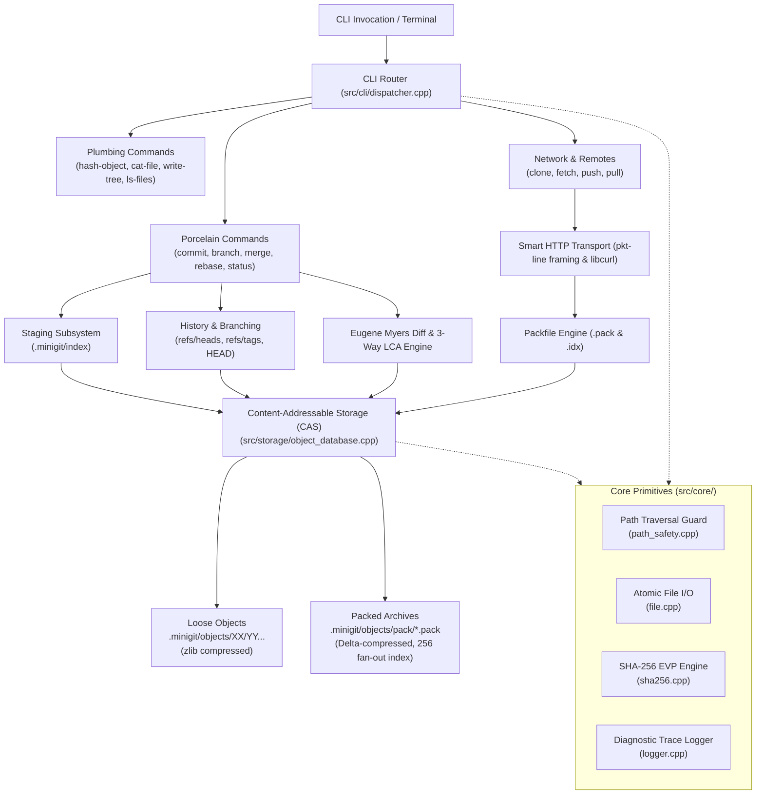

# MiniGit Architecture Specification

## 1. System Overview

MiniGit is a clean-room implementation of a distributed version control system in **C++20**. It implements the architectural principles of Git—content-addressable object storage, Directed Acyclic Graph (DAG) commit histories, a two-phase staging index, dynamic programming diff calculation, and network protocol framing—while maintaining a clean, modular structure.

---

## 2. Core Subsystems & Responsibilities

### 2.1 CLI & Routing (`src/cli/`)
- **`dispatcher.cpp`**: Fast $O(1)$ dispatch table mapping CLI command strings (`init`, `commit`, `merge`, etc.) to command handlers.
- **Global Options**: Intercepts `--trace`, `--trace=<file>`, and `--log-level=<level>` before forwarding arguments, ensuring zero-cost diagnostics on demand.
- **Plumbing vs. Porcelain**: Distinguishes end-user workflows (porcelain) from composable low-level utilities (plumbing).

### 2.2 Content-Addressable Storage (CAS) (`src/storage/`)
All entities in MiniGit are immutable objects identified by their 256-bit SHA-256 hash.
- **Loose Objects**: Stored under `.minigit/objects/<XX>/<YY...>` where `XX` is the first 2 hex digits and `YY...` are the remaining 62 hex digits. Sharding bounds filesystem directories to manageable file counts.
- **Object Header**: Format is `<type> <size>\0<content>`. Supported types: `blob`, `tree`, `commit`, `tag`.
- **Zlib Deflate**: Loose objects are compressed using zlib `deflate` at write time and decompressed transparently on read.
- **Packfile System (`pack.cpp`, `repack.cpp`)**: Consolidates thousands of loose objects into a single compressed `.pack` archive accompanied by an $O(\log N)$ binary search `.idx` fan-out index with copy/insert delta encoding.

### 2.3 Staging & Index (`src/staging/`)
- **Binary Cache (`.minigit/index`)**: Decouples active filesystem modifications from commit snapshots.
- **Format**: 12-byte header (`DIRC`, version 2, entry count) followed by sorted index entries containing file metadata (mtime, size, file mode), SHA-256 hash, and relative path.
- **Path Sanitization**: Every path added or refreshed in the index is checked against directory traversal vulnerabilities via `minigit::core::resolve_safe_repo_path`.
- **Ignore Rules (`ignore.cpp`)**: Pattern matching parser supporting `.minigitignore` with wildcard globs, directory markers, and `!` negations.

### 2.4 Diff Engine (`src/diff/`)
- **Algorithm**: Implements **Eugene Myers' $O(ND)$ greedy difference algorithm** (1986).
- **Edit Script**: Generates minimum edit sequences (`Keep`, `Add`, `Remove`) matching unified diff formatting (`@@ -l,s +l,s @@`).
- **Complexity**: $O(ND)$ time where $N$ is total lines and $D$ is the size of the minimal edit script; $O(D^2)$ space for edit graph tracking.

### 2.5 History, Merge & Rebase (`src/history/`, `src/merge/`)
- **Commit DAG**: Commits contain tree pointer, parent hashes (single parent for normal commits, dual parents for merges), author/committer metadata, and log message.
- **LCA Calculation**: Computes Lowest Common Ancestor (LCA) using breadth-first topological graph traversal.
- **3-Way Line Merge**: Compares base (ancestor), local (ours), and remote (theirs) using Myers diff. Non-conflicting edits merge cleanly; overlapping changes insert conflict markers (`<<<<<<<`, `=======`, `>>>>>>>`).
- **Rebase Engine (`rebase.cpp`)**: Replays a sequence of commits onto a new base commit, managing conflict state, interactive continues, aborts, and skips.

### 2.6 Multiple Worktrees (`src/worktree/`)
- Enables multiple linked working trees sharing the same primary repository storage.
- Commondir indirection references the main object database and ref namespace while keeping local index and HEAD isolated under `.minigit/worktrees/<name>/`.

### 2.7 Remote Synchronization & Smart HTTP (`src/remotes/`)
- Implements Git Transfer Protocol v1 over local filesystems and HTTP/HTTPS (via `libcurl`).
- **`pkt-line.cpp`**: Streams length-delimited packets prefixed with 4-byte hexadecimal length headers and `0000` flush delimiters.
- **Transfer Negotiation**: Computes common commits between local and remote ref advertisements, producing or consuming raw packfile byte streams.

### 2.8 MiniGit SDK & Polyglot Runtime Layer (`src/sdk/`, `sdks/`)
- **Native C++20 SDK (`libminigit_sdk`)**: Object-oriented programmatic API (`MiniGitClient`) exposing repository initialization, staging, commits, branches, DAG history traversal, and cloud/local backup synchronization.
- **C-Compatible FFI Interface (`extern "C"`)**: Standard C entry points (`minigit_sdk_init`, `minigit_sdk_commit`, etc.) enabling universal interop without C++ name mangling.
- **Polyglot SDK Bindings**: Dedicated SDK packages providing native idioms across **Python**, **JavaScript / TypeScript**, **Go**, **Java**, and **Rust**.
- **Docker Distribution**: Multi-stage OCI container image distributing the standalone CLI binary, SDK headers, static archive, and runtime dependencies.

---

## 3. Platform Abstraction & Memory Safety

- **Modern C++20**: Strict compliance with standard C++20 across GCC, Clang, and MSVC.
- **Filesystem**: Standardized on `std::filesystem` for portable path handling across Windows (`\` backslash) and POSIX (`/` forward slash) environments.
- **Resource Ownership (RAII)**: All file handles, zlib compression streams (`z_stream`), OpenSSL digest contexts (`EVP_MD_CTX`), and CURL session handles (`CURL*`) are encapsulated within RAII wrapper classes ensuring leak-free cleanup under normal and exceptional control flows.
